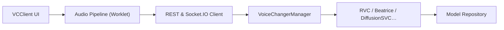

# w-okada/voice-changer

> Logiciel de conversion vocale en temps réel par IA (VCClient), pour changer de voix à la volée.

## Le problème
Convertir sa voix en direct avec un modèle IA, sans charger un jeu ou une visio.

## Ce que ça fait vraiment
Client web ou bureau (React/TypeScript) relié soit à un module local, soit à un serveur Python (REST et Socket.IO) qui charge des modèles de conversion (RVC, Beatrice, et d'autres en v1 : MMVC, so-vits-svc, DDSP-SVC). Le mode réseau délègue le calcul à une autre machine. Éditions par plateforme : `std` (Beatrice) et `cuda`/`onnx` (Beatrice et RVC). Une API REST est fournie. Le README est en japonais, traduit par machine.

## Comment c'est branché

## Essayer
Aucune commande documentée : le README renvoie aux téléchargements Hugging Face (Windows, Mac M1) et demande de cloner le dépôt pour Linux.

## Coût et pièges
Gratuit. Édition `cuda` pour Windows avec RVC. Le logiciel n'est pas signé (avertissement macOS, exécution à ses risques). Licence présente mais non identifiée par GitHub ; les modèles de voix (Tsukuyomi-chan, Amitaro, etc.) ont chacun des conditions d'usage strictes, listées dans le README.

## Ce que ce n'est pas
Pas un outil d'entraînement complet (le dépôt renvoie à d'autres dépôts pour Beatrice v2). Version 2.2.2 encore en bêta.

## Alternatives
Aucune alternative citée dans le README.

## Pour toi
Ignorer : application de niche, en bêta, à licence floue et à usages encadrés ; pas une brique pour un pipeline IA.

