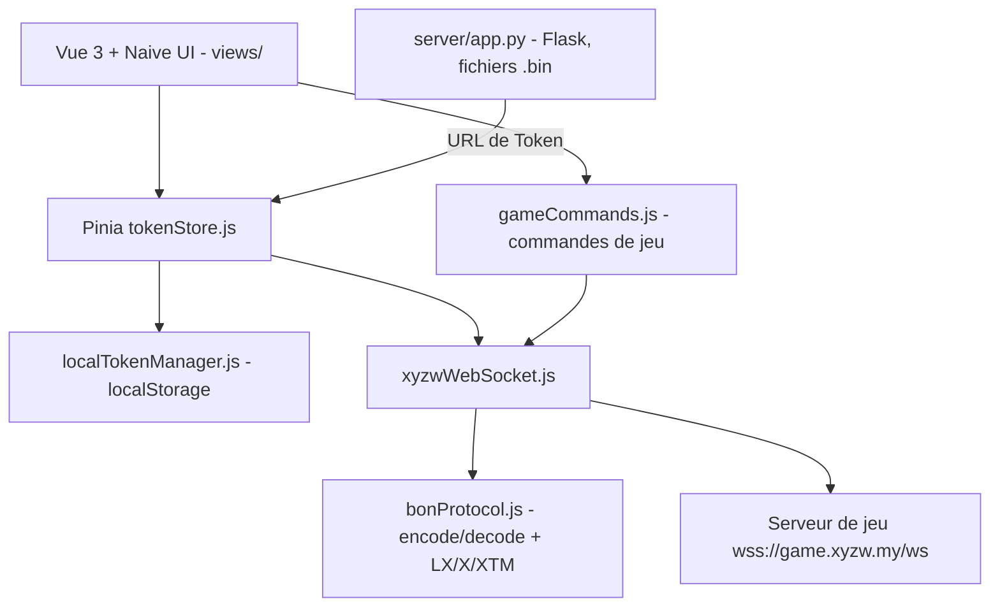

# w1249178256/xyzw_web_helper

> **One sentence.** A Vue 3 web front end that drives several XYZW game accounts over WebSocket, with no backend.

## The problem

Automating the daily chores of the XYZW game means speaking its in-house binary protocol and juggling one token per account by hand.
Without a dedicated front end, every token is pasted, decoded and reconnected manually, and nothing survives a page reload.

## What it actually does

- Imports game tokens in Base64, either pasted by hand or pulled from an API URL returning `{"token": ..., "server": ...}`, with automatic refresh.
- Implements the BON (Binary Object Notation) protocol in JavaScript: `bon.encode` / `bon.decode`, plus three announced encryption schemes (LX, X, XTM) and auto-detection on decrypt.
- Keeps a WebSocket client with a connection pool, a message queue, heartbeats and exponential-backoff reconnection, one connection per token.
- Stores tokens and preferences in the browser only (localStorage), with no mandatory backend; the UI masks each token except its first and last four characters.
- Renders game screens: daily tasks, monthly tasks (fishing, arena), team status, tower progress, character identity card.
- Ships two built-in debug tools, `MessageTester.vue` (encode/decode BON) and `WebSocketTester.vue` (watch the live connection).

## How it is wired

The browser holds all state; the only outbound flow is the WebSocket to the game servers, plus an optional HTTP call to the bundled Flask service to fetch a token.



The Cloudflare Pages worker (`dist/_worker.js`) serves the static build and proxies `/api` in production.

## Trying it

```bash
git clone https://github.com/your-repo/xyzw-web-helper.git
cd xyzw-web-helper
pnpm install
pnpm run dev
pnpm run build
pnpm run preview
```

For the token-fetching service the README gives: `cd server`, `pip install -r requirements.txt`, then `python app.py` (listens on `0.0.0.0:5000`). To emulate Cloudflare Pages locally: `npm install -g wrangler`, `npm run build`, `npx wrangler pages dev dist`, then open `http://localhost:8787`.

## Cost and gotchas

Nothing to pay for the code: Node.js >= 18 and pnpm >= 9 are enough. But you need an XYZW game account and a valid token, so the whole thing depends on a third-party service the project does not control: if the game's protocol or encryption changes, the tool breaks. The optional Flask service starts with a hard-coded admin account, `admin` / `admin123`, and is meant to listen on `0.0.0.0:5000` — exposing it as-is hands out every user's `.bin` token files. The CC BY-NC-SA 4.0 licence forbids commercial use, and GitHub does not recognise it (NOASSERTION), so the legal footing is unclear. The recommended deployment assumes a Cloudflare Pages account.

## What it is not

It is not a reusable binary-protocol library: the BON codec is written for this one game and lives in `src/utils/`, not in a published npm package.
It is not a server-side bot that runs on its own: everything executes in the browser tab, closing the page drops the connections — "daily automation" still needs someone to open the page.
It is not blessed by the game publisher: the README claims there is no ban or account-leak risk, with nothing to back it up.

## Alternatives

No comparable alternative in the catalogue. The suggested neighbours — gatsbyjs/gatsby, prettier/prettier, meteor/meteor, Kong/insomnia — are generic JavaScript-ecosystem tools (site generator, code formatter, full-stack framework, API client) matched by the "JavaScript / WebSocket" vocabulary; none drives a game or speaks the BON protocol.

## For you

Skip it: nothing here serves a data / AI / MLOps profile, and the one technically interesting piece — a hand-rolled binary codec with three encryption layers — is welded to one specific game, under a non-commercial licence, maintained by a single person.
