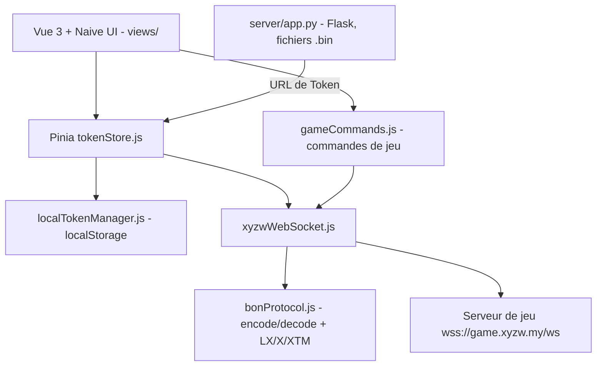

# w1249178256/xyzw_web_helper

> **Une phrase.** Interface web Vue 3 qui pilote plusieurs comptes du jeu XYZW par WebSocket, sans serveur.

## Le problème

Automatiser les tâches quotidiennes du jeu XYZW suppose de parler son protocole binaire maison et de jongler à la main avec les jetons de plusieurs comptes.
Sans outil dédié, chaque jeton se colle, se décode et se reconnecte manuellement, et rien ne survit au rechargement de la page.

## Ce que ça fait vraiment

- Importe des jetons de jeu en Base64, soit collés à la main, soit récupérés depuis une URL d'API renvoyant `{"token": ..., "server": ...}`, avec rafraîchissement automatique.
- Implémente en JavaScript le protocole BON (Binary Object Notation) : `bon.encode` / `bon.decode`, plus trois schémas de chiffrement annoncés (LX, X, XTM) et une détection automatique au déchiffrement.
- Tient un client WebSocket avec pool de connexions, file de messages, heartbeat et reconnexion à backoff exponentiel, une connexion par jeton.
- Stocke jetons et préférences uniquement dans le navigateur (localStorage), sans backend obligatoire ; l'affichage masque le jeton sauf ses quatre premiers et derniers caractères.
- Affiche des écrans de jeu : tâches quotidiennes, tâches mensuelles (pêche, arène), état d'équipe, progression de la tour, carte d'identité de personnage.
- Fournit deux outils de debug intégrés, `MessageTester.vue` (encoder/décoder du BON) et `WebSocketTester.vue` (suivre la connexion en direct).

## Comment c'est branché

Le navigateur garde tout l'état ; le seul flux sortant est le WebSocket vers les serveurs du jeu, plus un appel HTTP optionnel au service Flask fourni pour obtenir un jeton.



Le worker Cloudflare Pages (`dist/_worker.js`) sert les fichiers statiques et fait le proxy `/api` en production.

## Essayer

```bash
git clone https://github.com/your-repo/xyzw-web-helper.git
cd xyzw-web-helper
pnpm install
pnpm run dev
pnpm run build
pnpm run preview
```

Pour le service de récupération de jetons, le README donne : `cd server`, `pip install -r requirements.txt`, puis `python app.py` (écoute sur `0.0.0.0:5000`). Pour simuler Cloudflare Pages en local : `npm install -g wrangler`, `npm run build`, `npx wrangler pages dev dist`, puis `http://localhost:8787`.

## Coût et pièges

Rien à payer côté code : Node.js >= 18 et pnpm >= 9 suffisent. Mais il faut un compte de jeu XYZW et un jeton valide, donc une dépendance totale à un service tiers que le projet ne contrôle pas : si le protocole ou le chiffrement du jeu change, l'outil casse. Le service Flask optionnel démarre avec un compte administrateur en dur, `admin` / `admin123`, et est prévu pour tourner sur `0.0.0.0:5000` — l'exposer tel quel revient à offrir les fichiers `.bin` de jetons de tous les utilisateurs. La licence CC BY-NC-SA 4.0 interdit tout usage commercial, et GitHub ne la reconnaît pas (NOASSERTION), donc aucune protection juridique claire. Le déploiement recommandé suppose un compte Cloudflare Pages.

## Ce que ce n'est pas

Ce n'est pas une bibliothèque réutilisable de protocole binaire : le codec BON est écrit pour ce jeu précis et vit dans `src/utils/`, pas dans un paquet npm publié.
Ce n'est pas un bot serveur qui tourne seul : tout s'exécute dans l'onglet du navigateur, fermer la page coupe les connexions — l'automatisation « quotidienne » suppose que quelqu'un ouvre la page.
Ce n'est pas approuvé par l'éditeur du jeu : le README promet « pas de risque de bannissement » sans rien pour l'étayer, c'est une affirmation, pas une garantie.

## Alternatives

Aucune alternative comparable dans le catalogue. Les voisins proposés — gatsbyjs/gatsby, prettier/prettier, meteor/meteor, Kong/insomnia — sont des outils génériques de l'écosystème JavaScript (générateur de site, formateur de code, framework full-stack, client d'API) rapprochés par le lexique « JavaScript / WebSocket » ; aucun ne pilote un jeu ni ne parle le protocole BON.

## Pour toi

Passe ton chemin : rien ici ne sert un profil data / IA / MLOps, et la seule pièce techniquement intéressante — un codec binaire maison avec trois couches de chiffrement — est soudée à un jeu précis, sous licence non commerciale et portée par un seul mainteneur.
