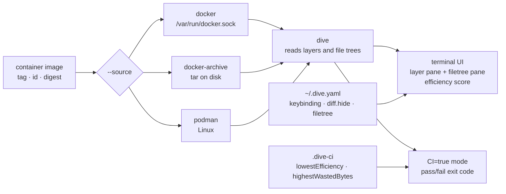

# wagoodman/dive

> **A terminal explorer for a container image's layer-by-layer contents, to see where the size goes.**

## The problem

A container image weighing 1.8 GB does not tell you where that weight comes from.
`docker history` gives each layer's size and the command that produced it, but not *which
files* were added, moved, overwritten or deleted — and that is exactly where the waste hides:
a file copied into one layer and deleted in the next still ships inside the image. Without
layer-by-layer inspection you tune your Dockerfile blind, shuffling lines and hoping the
number drops.

## What it actually does

dive opens a two-pane terminal interface. On the left, the image's layers with their sizes; on
the right, the file tree for the selected layer combined with every layer before it. Added,
modified, removed and unmodified files are marked in the tree, and you can switch between the
current layer's changes (`Ctrl + L`) and the changes aggregated from the start (`Ctrl + A`),
or hide a category of diff altogether.

The lower left pane shows what the README itself calls an experimental metric: "image
efficiency", a percentage score plus a total of wasted space, estimated from files duplicated
across layers, moved between layers, or deleted without their content leaving the image.

Two uses step outside the interactive view. `dive build -t <tag> .` builds the image and goes
straight into analysing it, as a drop-in replacement for `docker build`. And with the
environment variable `CI=true`, the UI is bypassed: dive analyses and returns a pass/fail exit
code against three thresholds described in a `.dive-ci` file at the repository root —
`lowestEfficiency`, `highestWastedBytes`, `highestUserWastedPercent`.

The image under analysis can come from several sources, selected with `--source` or the
`<source>://` prefix: the Docker engine (the default), a Docker tar archive on disk
(`docker-archive`), or Podman (Linux only).

## How it is wired



No code-derived diagram exists for this repository: the graph above is reconstructed from the
README alone. The thing to take from it is that dive builds nothing itself outside
`dive build` — it reads an image already held by a container engine, which is why the Docker
socket shows up in every containerised way of running it.

## Trying it

```bash
dive <your-image-tag>
```

With no local install, through the Docker image:

```bash
alias dive="docker run -ti --rm  -v /var/run/docker.sock:/var/run/docker.sock docker.io/wagoodman/dive"
dive <your-image-tag>

# for example
dive nginx:latest
```

Build then analyse in one step, and run the analysis in continuous integration:

```bash
dive build -t <some-tag> .
CI=true dive <your-image>
```

Installation, pick your system — the README lists about a dozen:

```bash
brew install dive
pacman -S dive
choco install dive
go install github.com/wagoodman/dive@latest
docker pull docker.io/wagoodman/dive
```

## Cost and pitfalls

- **Free, MIT licence** per the catalogue row and the README badge. The only financial link is
  a PayPal donation button.
- **You need a reachable container engine.** The containerised invocations bind-mount
  `/var/run/docker.sock`, that is, they hand the container control of the host's Docker daemon.
  Worth weighing before spreading the alias across a shared workstation or a CI pipeline.
- **Docker API version mismatches**: the README warns that you may have to force
  `DOCKER_API_VERSION=1.37`, and with an alternative runtime such as Colima, export
  `DOCKER_HOST` from `docker context inspect` so local images are found.
- **The README explicitly discourages the snap** if Docker was installed via `apt-get`: it may
  break the existing Docker daemon (`CAUTION` note, issue 546).
- **`go install` does not stamp the version**: `dive -v` will not report a proper number.
- **The README calls the project "beta quality" itself**, and the efficiency metric is
  described as experimental: the score is not an exact measure of what you can reclaim.
- **Podman is Linux-only**, and building on macOS necessarily goes through the container with
  the working directory mounted.

## What it is not

- **It is not an optimiser.** dive shows where the space goes; it does not rewrite your
  Dockerfile, squash layers or delete anything. The shrinking work stays manual.
- **It is not a vulnerability scanner or a compliance tool**: it talks about size and file
  diffs, not CVEs, SBOMs or signatures.
- **It is not a service or a web UI**: it is a terminal binary, and the CI mode only yields an
  exit code — no dashboard, no trend history.
- **The efficiency score is not a goal in itself.** An image whose bulk sits in one legitimate
  base layer will score well without being small: the metric measures *waste* between layers,
  not absolute size. The README notes accordingly that the base image layer is excluded from
  the total for `highestUserWastedPercent`.

## Alternatives

No comparable alternative in the catalogue. The neighbours proposed for this repository
(`docker/cli`, `mikefarah/yq`, `opencontainers/runc`, `gruntwork-io/terragrunt`) share its
container and YAML vocabulary without serving the same purpose: `docker/cli` is the official
client whose socket dive consumes — its `docker history` command is the starting point dive
extends, not a competitor; `opencontainers/runc` is the low-level runtime; `mikefarah/yq`
manipulates YAML; `terragrunt` orchestrates Terraform. The README names no competing tool.

## For you

Useful as soon as you build container images for training or model serving — the kind of image
that swells between CUDA wheels, weights and package caches left behind. Ten minutes with dive
on an image answers "why does it weigh that" more reliably than another pass over the
Dockerfile. The `CI=true` mode with a `.dive-ci` file then lets you block regressions, provided
you accept thresholds built on a metric its own author calls experimental. Install it locally
rather than writing it into your standard stack: it is an occasional diagnostic tool,
maintained by one person.
