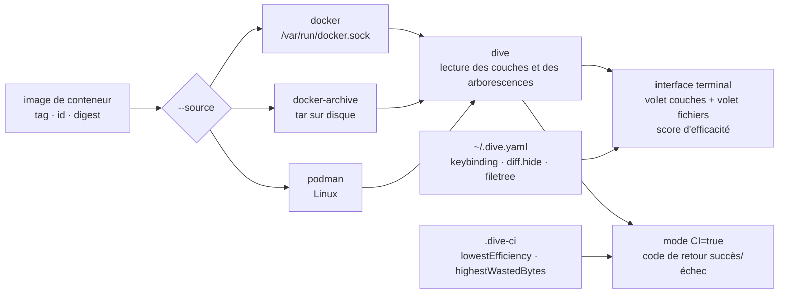

# wagoodman/dive

> **Un explorateur en terminal du contenu couche par couche d'une image de conteneur, pour voir où part la place.**

## Le problème

Une image de conteneur qui pèse 1,8 Go ne dit pas d'où vient son poids. `docker history` donne
la taille de chaque couche et la commande qui l'a produite, mais pas *quels fichiers* ont été
ajoutés, déplacés, écrasés ou supprimés — or c'est exactement là que se cache le gaspillage :
un fichier copié dans une couche puis supprimé dans la suivante reste dans l'image. Sans
inspection couche par couche, on optimise son Dockerfile à l'aveugle, en déplaçant des lignes
en espérant que la taille descende.

## Ce que ça fait vraiment

dive ouvre une interface en terminal à deux volets. À gauche, la liste des couches de l'image
avec leur taille ; à droite, l'arborescence de fichiers correspondant à la couche
sélectionnée, combinée avec toutes les précédentes. Les fichiers ajoutés, modifiés, supprimés
ou inchangés sont marqués dans l'arbre, et on peut basculer entre les modifications de la
couche courante (`Ctrl + L`) et les modifications agrégées depuis le début (`Ctrl + A`), ou
masquer une catégorie de différence.

Le volet inférieur gauche affiche une métrique que le README qualifie d'expérimentale :
l'« efficacité d'image », un score en pourcentage plus un total d'espace gaspillé, estimé à
partir des fichiers dupliqués entre couches, déplacés d'une couche à l'autre, ou supprimés
sans que leur contenu disparaisse de l'image.

Deux usages sortent de l'interactif. `dive build -t <tag> .` construit l'image puis enchaîne
directement sur son analyse, en remplacement de `docker build`. Et avec la variable
d'environnement `CI=true`, l'interface est court-circuitée : dive analyse et renvoie un code
de retour réussite/échec selon trois seuils décrits dans un fichier `.dive-ci` à la racine du
dépôt — `lowestEfficiency`, `highestWastedBytes`, `highestUserWastedPercent`.

L'image à analyser peut venir de plusieurs sources, choisies avec `--source` ou le préfixe
`<source>://` : le moteur Docker (par défaut), une archive tar Docker sur disque
(`docker-archive`), ou Podman (Linux uniquement).

## Comment c'est branché



Aucun diagramme tiré du code n'existe pour ce dépôt : ce schéma est reconstruit depuis le seul
README. Le point à retenir est que dive ne construit rien lui-même hors de `dive build` — il
lit une image déjà présente dans un moteur de conteneurs, ce qui explique la dépendance au
socket Docker dans tous les modes d'exécution conteneurisés.

## Essayer

```bash
dive <your-image-tag>
```

Sans installation locale, en passant par l'image Docker :

```bash
alias dive="docker run -ti --rm  -v /var/run/docker.sock:/var/run/docker.sock docker.io/wagoodman/dive"
dive <your-image-tag>

# for example
dive nginx:latest
```

Construire puis analyser dans la foulée, et lancer l'analyse en intégration continue :

```bash
dive build -t <some-tag> .
CI=true dive <your-image>
```

Installation, au choix du système — le README en liste une dizaine :

```bash
brew install dive
pacman -S dive
choco install dive
go install github.com/wagoodman/dive@latest
docker pull docker.io/wagoodman/dive
```

## Coût et pièges

- **Gratuit, licence MIT** d'après le lot et le badge du README. Le seul lien financier est un
  bouton de don PayPal.
- **Il faut un moteur de conteneurs accessible.** Les invocations conteneurisées montent
  `/var/run/docker.sock` en volume, c'est-à-dire qu'elles donnent au conteneur le contrôle du
  démon Docker de l'hôte. À peser avant de généraliser l'alias sur un poste partagé ou dans
  une chaîne d'intégration.
- **Incompatibilités de version d'API Docker** : le README prévient qu'il faut parfois forcer
  `DOCKER_API_VERSION=1.37`, et avec un runtime alternatif comme Colima, exporter
  `DOCKER_HOST` depuis `docker context inspect` pour que les images locales soient trouvées.
- **Le README déconseille explicitement le snap** si Docker a été installé via `apt-get` : cela
  peut casser le démon Docker existant (avertissement `CAUTION`, issue 546).
- **`go install` ne renseigne pas la version** : `dive -v` n'affichera pas un numéro correct.
- **Le README annonce lui-même « beta quality »**, et la métrique d'efficacité est décrite
  comme expérimentale : un score n'est pas une mesure exacte de ce qu'on peut récupérer.
- **Podman est limité à Linux**, et la construction sur macOS passe obligatoirement par le
  conteneur avec montage du répertoire de travail.

## Ce que ce n'est pas

- **Ce n'est pas un optimiseur.** dive montre où va la place ; il ne réécrit pas le Dockerfile,
  ne fusionne pas de couches et ne supprime rien. Le travail de réduction reste manuel.
- **Ce n'est pas un scanner de vulnérabilités ni un outil de conformité** : il parle de taille
  et de différences de fichiers, pas de CVE, de SBOM ou de signatures.
- **Ce n'est pas un service ni une interface web** : c'est un binaire en terminal, et le mode
  CI ne produit qu'un code de retour, pas de tableau de bord ni d'historique de tendance.
- **Le score d'efficacité n'est pas un objectif en soi.** Une image dont le gros du poids tient
  à une seule couche de base légitime affichera un bon score sans être petite : la métrique
  mesure le *gaspillage* entre couches, pas la taille absolue. Le README note d'ailleurs que la
  couche d'image de base n'est pas comptée dans le total pour `highestUserWastedPercent`.

## Alternatives

Aucune alternative comparable dans le catalogue. Les voisins proposés pour ce dépôt
(`docker/cli`, `mikefarah/yq`, `opencontainers/runc`, `gruntwork-io/terragrunt`) partagent
son vocabulaire de conteneurs et de YAML sans remplir la même fonction : `docker/cli` est le
client officiel dont dive consomme le socket — sa commande `docker history` est le point de
départ que dive prolonge, mais ce n'est pas un concurrent ; `opencontainers/runc` est le
moteur d'exécution bas niveau ; `mikefarah/yq` manipule du YAML ; `terragrunt` orchestre
Terraform. Le README ne nomme aucun outil concurrent.

## Pour toi

Utile dès qu'on construit des images de conteneur pour de l'entraînement ou du service de
modèle, c'est-à-dire des images qui grossissent vite entre les roues CUDA, les poids et les
caches de paquets laissés derrière. Dix minutes avec dive sur une image répondent à la
question « pourquoi elle pèse ça » plus sûrement qu'une relecture de Dockerfile. Le mode
`CI=true` avec un fichier `.dive-ci` permet ensuite de bloquer la régression, à condition
d'accepter les seuils d'une métrique déclarée expérimentale. À installer en local plutôt qu'à
inscrire au socle : c'est un outil de diagnostic ponctuel, maintenu par une seule personne.
