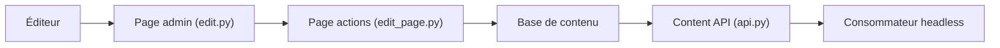

# wagtail/wagtail

> CMS open source construit sur Django, pour les équipes qui publient du contenu éditorial.

## Le problème
Publier et faire relire des pages demande une interface d'édition, des droits, des révisions et une API, que Django seul ne fournit pas.

## Ce que ça fait vraiment
Interface d'administration pour les auteurs, StreamField pour du contenu flexible, workflows de validation, recherche (Elasticsearch ou PostgreSQL), images, documents, snippets, multilingue, redirections, invalidation de cache frontal et API de contenu pour sites « headless ». Le README annonce le support de Django 5.2 à 6.1, Python 3.11 à 3.14 et PostgreSQL, MySQL, MariaDB ou SQLite. Une version sort tous les trois mois.

## Comment c'est branché


## Essayer
```bash
pip install wagtail
wagtail start mysite
cd mysite
pip install -r requirements.txt
python manage.py migrate
python manage.py createsuperuser
python manage.py runserver
```

## Coût et pièges
Gratuit ; un support commercial existe séparément. Un environnement virtuel Python 3 est requis. Environ 1 000 issues ouvertes. Les versions nocturnes sont disponibles mais non stables.

## Ce que ce n'est pas
Pas un outil de données : c'est un système de gestion de contenu. Le descriptif d'architecture précise que certains enchaînements internes ne sont pas établis.

## Alternatives
Aucune alternative citée dans le README.

## Pour toi
Ignorer : un CMS Django sans lien avec l'IA ou le MLOps, sauf si tu dois publier de la documentation ou un site éditorial.

