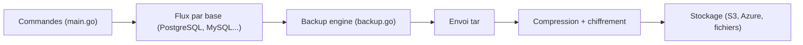

# wal-g/wal-g

> Outil d'archivage et de restauration de bases (PostgreSQL, MySQL, SQL Server) vers un stockage objet.

## Le problème
Sauvegarder et restaurer de grosses bases, avec archivage continu des WAL, est lent et coûteux sans compression et parallélisme.

## Ce que ça fait vraiment
Successeur de WAL-E, écrit en Go. Commandes par base (`backup-push`, `backup-fetch`, `backup-list`, `delete`, et WAL pour Postgres) ; sauvegardes compressées (LZ4, LZMA, ZSTD, Brotli) et chiffrées (libsodium, OpenPGP, KMS Yandex), stockage S3, Azure ou système de fichiers, métriques statsd, limitation de débit. Support bêta MongoDB et Redis, Greenplum/Cloudberry « production ready », etcd et FoundationDB en cours.

## Comment c'est branché


## Essayer
```bash
tar -zxvf wal-g-pg-24.04-amd64.tar.gz
mv wal-g-pg-24.04-amd64 /usr/local/bin/wal-g
wal-g backup-list --pretty
wal-g delete retain FULL 5 --confirm
```

## Coût et pièges
Gratuit ; stockage objet à ta charge. `delete` fait un essai à blanc sans `--confirm`. Après une montée de version majeure de Postgres, `retain` peut supprimer de nouvelles sauvegardes : utiliser `--use-sentinel-time`. Licence Apache annoncée mais support LZO en GPL 3.0 ; GitHub ne l'identifie pas. 320 issues ouvertes.

## Ce que ce n'est pas
Pas un outil de réplication ni de haute disponibilité. Les moteurs « beta » ne se prêtent pas à des données critiques sans validation.

## Alternatives
WAL-E (prédécesseur cité dans le README).

## Pour toi
À surveiller si ton entrepôt ou ta base de features est PostgreSQL ou MySQL : bon candidat pour sauvegardes et restauration à un instant donné ; teste la restauration avant de lui faire confiance.

