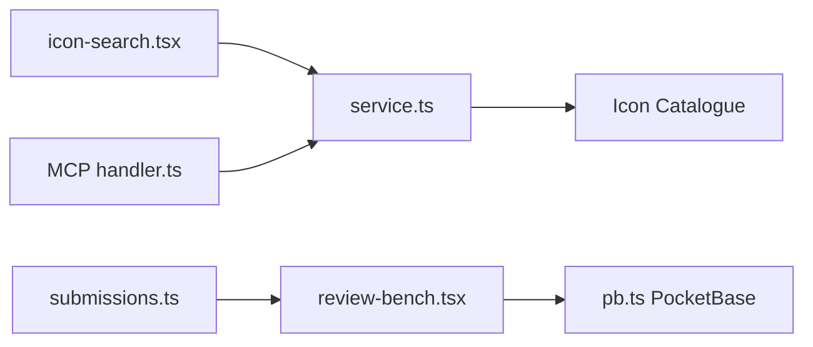

# walkxcode/dashboard-icons

> Collection de plus de 1800 icônes de services et d'applications pour tableaux de bord, en SVG, PNG et WEBP.

## Le problème
Les tableaux de bord et annuaires d'applications ont besoin d'icônes cohérentes, avec variantes claire et sombre.

## Ce que ça fait vraiment
Fournit les icônes via CDN (jsDelivr) ou GitHub selon `<Base URL>/<Format>/<Nom>.<Format>`, avec suffixes `-light` et `-dark`. Un site (dashboardicons.com) permet de chercher, de soumettre et de faire relire des icônes (PocketBase), indexe des icônes externes (Simple Icons) et expose un serveur MCP.

## Comment c'est branché


## Essayer
```bash
curl -O https://cdn.jsdelivr.net/gh/homarr-labs/dashboard-icons/svg/nextcloud.svg
wget https://cdn.jsdelivr.net/gh/homarr-labs/dashboard-icons/svg/nextcloud.svg
```

## Coût et pièges
Gratuit. Marques et logos restent la propriété de leurs détenteurs ; les icônes Simple Icons (CC0) ne lèvent pas les restrictions de marque. Le README parle de `homarr-labs` : le dépôt a été transféré.

## Ce que ce n'est pas
Pas une bibliothèque d'icônes générique : spécifique aux services auto-hébergés. Les icônes de marque ne sont pas libres de tout usage.

## Alternatives
- Simple Icons : indexé via un proxy colorable, collection CC0.

## Pour toi
À surveiller : pratique pour un portail interne ou un tableau MLOps, sans enjeu technique ; vérifie les règles de marque.

