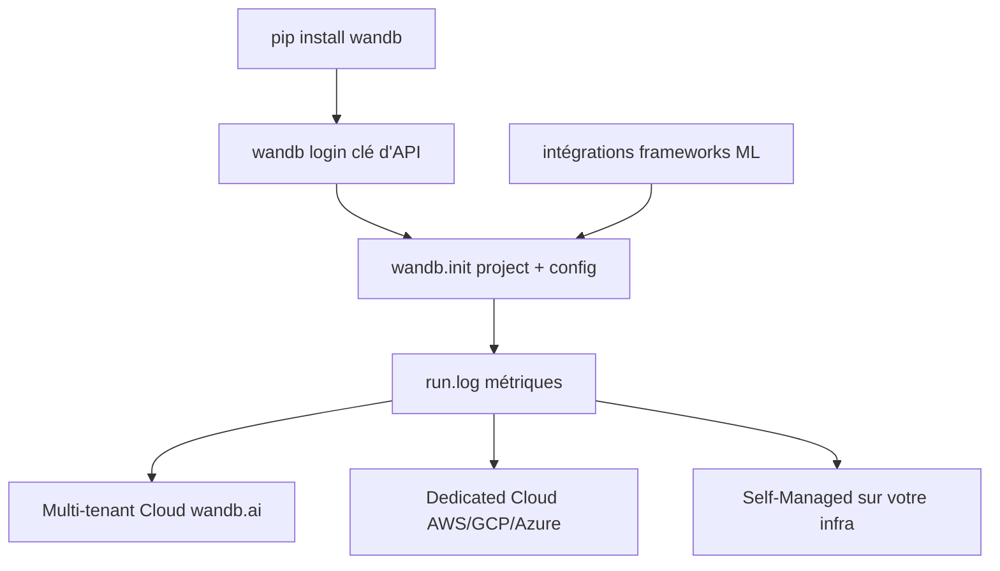

# wandb/wandb

> Client Python de suivi d'expériences ML — métriques, hyperparamètres, versions de données — vers un service hébergé.

## Le problème
Les résultats d'entraînement finissent dans des logs, des notebooks et des noms de fichiers, donc irretrouvables.
Comparer deux runs et savoir ce qui a changé devient un exercice de mémoire.

## Ce que ça fait vraiment
`wandb.init(project=..., config=...)` ouvre un run ; `run.log({...})` envoie les métriques au fur et à mesure.
La syntaxe `with wandb.init(...)` marque le run terminé en sortie de bloc, et échoué en cas d'exception.
Les runs, leurs courbes et leurs configurations se consultent sur wandb.ai ; le suivi couvre aussi le versionnement de données.
S'intègre aux cadres ML courants ; Weave est la suite annexe dédiée aux applications LLM.

## Comment c'est branché


## Essayer
```shell
pip install wandb
```

## Coût et pièges
Compte obligatoire et clé d'API — visible une seule fois à la création, donc à ranger dans un gestionnaire de secrets.
Trois hébergements : multi-tenant sur le GCP de W&B (Amérique du Nord), Dedicated Cloud mono-locataire, ou auto-hébergé. Les deux derniers sont des offres commerciales.

## Ce que ce n'est pas
Pas un outil local : le client pousse vers un serveur, hébergé par W&B ou par vous.
Pas un orchestrateur d'entraînement : il observe, il ne lance rien.
Pas l'outil LLM du même éditeur : c'est Weave, un produit distinct.

## Alternatives
- Weave : du même éditeur, pour le suivi et l'évaluation d'applications GenAI plutôt que d'entraînements.

## Pour toi
Le standard de fait du suivi d'expériences : à adopter, en vérifiant d'abord où atterrissent tes données.
