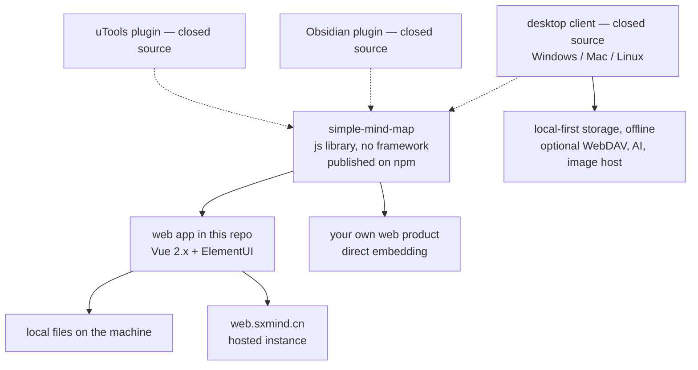

# wanglin2/mind-map

> **A framework-free JavaScript mind map library for embedding a map editor in your own web product.**

## The problem

Rendering and editing a mind map in the browser means writing tree layout, drawing, selection,
drag and drop and derived structures (org chart, timeline, fishbone) yourself — weeks of work
before any domain code. Most existing answers are closed applications, not components you can
embed.

## What it actually does

The repository holds **two separate things**, and telling them apart is the point of this sheet.

- The open part is a `js` mind map library, published on npm as `simple-mind-map`, depending on
  no framework, meant as the base for building a web mind map product. Its developer
  documentation lives outside the repo, at `wanglin2.github.io/mind-map-docs`.
- The second open part is a demo web application built on that library with `Vue 2.x` and
  `ElementUI`. It can work with local files on the machine, runs online at `web.sxmind.cn`, and
  can be self-hosted and modified.
- The README states that the code in this repository is in a **low-maintenance state**
  (低维护状态). Development effort is declared to be on the desktop client and the plugins,
  whose code is **not** open.
- The long feature list in the README (multiple structure types, hundreds of themes, import from
  XMind/FreeMind/Markdown/Txt/Xlsx, export to PNG/SVG/PDF/Mermaid/Html, AI generation, WebDAV
  sync, presentation mode, bidirectional node links) is announced for **the closed client**, not
  for the library in this repo.

## How it is wired

No code-derived diagram exists for this repository: the graph below is reconstructed from the
README alone, which names no source file.



The dotted edges mark the boundary: what the README describes at greatest length (client,
plugins) is not in this repository.

## Trying it

The README **documents no install or start command** for the library or the web application; it
points to external documentation instead. Its only command block unblocks the desktop client on
macOS:

```bash
sudo xattr -d com.apple.quarantine /Applications/思绪思维导图.app
```

Everything else is an address rather than a command: the npm package `simple-mind-map`, the docs
at `https://wanglin2.github.io/mind-map-docs/`, the hosted app at `https://web.sxmind.cn/`, and
client binaries in the GitHub releases.

## Cost and gotchas

- **Free on the repository side**, but the README says nothing about the pricing of the closed
  client or of the Obsidian plugin — worth checking before building company use on top.
- **No API key, no GPU, no Docker** for the library: it is browser JavaScript. The client's AI
  settings and image-host settings do imply third-party services, which the README does not name.
- **Vue 2.x and ElementUI** for the demo app: end-of-life versions, to weigh before reusing this
  code as a base.
- **Documentation outside the repo, README mostly in Chinese** (an English `README_EN.md`
  exists): the real cost is reading.
- **Declared low maintenance** on the open part: fixes are not promised.

## What it is not

- **It is not the "思绪思维导图" application open-sourced.** The desktop client and the Obsidian
  and uTools plugins are explicitly closed, and nearly every checked box in the README belongs to
  them. Downloading a binary is not reading its code.
- **It is not a finished deployable product**: the open part is a display-and-edit component plus
  a demo application, to be embedded and completed.
- **It is not a community project**: a single author appears, and effort is openly shifting to
  the non-open side.

## Alternatives

No comparable alternative in the catalogue: no neighbours were supplied with this repository, and
the other names in the README (XMind, FreeMind, Obsidian, uTools) are import/export formats or
host applications, not competing mind map libraries.

## For you

Little direct bearing on a data / AI / MLOps role: this is web UI. Its use, if any, is occasional
— giving an internal tool an editable tree view (decision tree, experiment plan, source map)
without writing it yourself, with a Mermaid or Markdown export usable downstream. Watch it rather
than adopt it: single maintainer, declared low maintenance on the open part, and the real value
concentrated in closed software.
