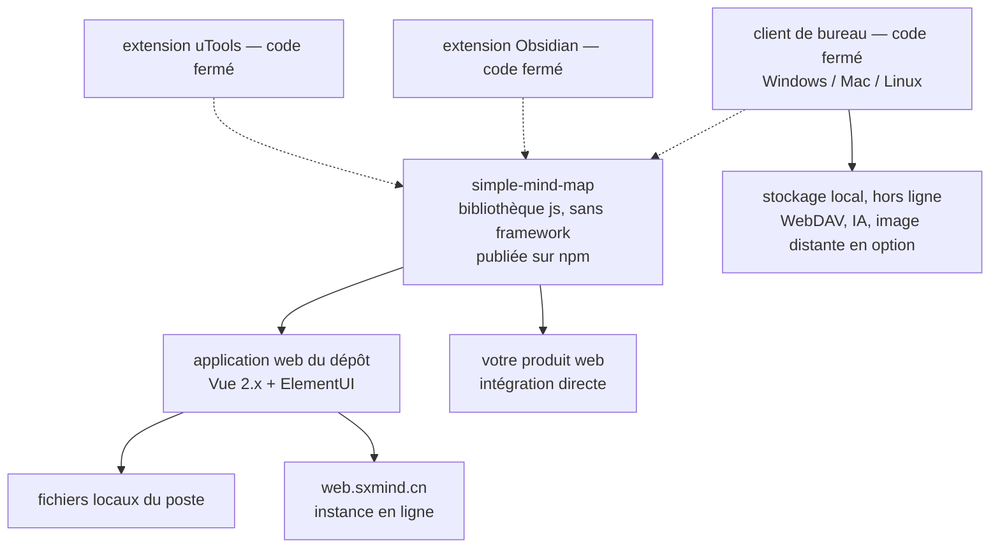

# wanglin2/mind-map

> **Une bibliothèque JavaScript de carte mentale sans framework, pour intégrer un éditeur dans son propre produit web.**

## Le problème

Afficher et éditer une carte mentale dans le navigateur suppose d'écrire soi-même la mise en
page arborescente, le rendu, la sélection, le glisser-déposer et les structures dérivées
(organigramme, frise, arête de poisson) — des semaines de travail avant la première ligne de
métier. Les solutions existantes sont le plus souvent des applications fermées, pas des
composants qu'on embarque.

## Ce que ça fait vraiment

Le dépôt contient **deux choses distinctes**, et la distinction est le point important de la
fiche.

- La partie ouverte est une bibliothèque `js` de carte mentale, publiée sur npm sous le nom
  `simple-mind-map`, qui ne dépend d'aucun framework et sert de socle pour développer un
  produit de carte mentale web. Sa documentation de développement est hébergée séparément
  (`wanglin2.github.io/mind-map-docs`).
- La seconde partie ouverte est une application web de démonstration bâtie sur cette
  bibliothèque avec `Vue 2.x` et `ElementUI`, capable de manipuler les fichiers locaux du poste,
  utilisable en ligne (`web.sxmind.cn`), auto-hébergeable et modifiable.
- Le README annonce que le code de ce dépôt est **en état de maintenance faible**
  (低维护状态). L'effort de développement est déclaré porté sur le logiciel client et les
  extensions, dont le code n'est **pas** ouvert.
- Les fonctions abondantes listées par le README (types de structure multiples, centaines de
  thèmes, import XMind/FreeMind/Markdown/Txt/Xlsx, export PNG/SVG/PDF/Mermaid/Html, génération
  par IA, synchronisation WebDAV, mode présentation, liens bidirectionnels) sont annoncées pour
  **le client fermé**, pas pour la bibliothèque du dépôt.

## Comment c'est branché

Aucun diagramme tiré du code n'existe pour ce dépôt : ce schéma est reconstruit depuis le seul
README, qui ne nomme aucun fichier source.



Les traits pointillés marquent la frontière : ce que le README décrit le plus longuement
(client, extensions) n'est pas dans ce dépôt.

## Essayer

Le README **ne documente aucune commande d'installation ni de démarrage** pour la bibliothèque
ou l'application web : il renvoie à la documentation externe. Le seul bloc de commandes qu'il
contient concerne le déblocage du client de bureau sous macOS :

```bash
sudo xattr -d com.apple.quarantine /Applications/思绪思维导图.app
```

Pour le reste, le README donne des adresses, pas des commandes : le paquet npm
`simple-mind-map`, la documentation `https://wanglin2.github.io/mind-map-docs/`, l'application
en ligne `https://web.sxmind.cn/` et les binaires du client dans les *releases* GitHub.

## Coût et pièges

- **Gratuit côté dépôt**, mais le README ne dit rien du modèle économique du client fermé ni de
  l'extension Obsidian — à vérifier avant de bâtir un usage d'entreprise dessus.
- **Aucune clé d'API, aucun GPU, aucun Docker** requis pour la bibliothèque : c'est du
  JavaScript navigateur. La configuration IA et la configuration d'hébergement d'images du
  client supposent en revanche des services tiers que le README ne nomme pas.
- **Vue 2.x et ElementUI** pour l'application de démonstration : ce sont des versions de
  bibliothèques en fin de vie, à peser avant de reprendre ce code comme base.
- **Documentation hors dépôt et README majoritairement en chinois** (une version anglaise
  existe, `README_EN.md`) : le coût réel est celui de la lecture.
- **Maintenance faible déclarée** sur la partie ouverte : les correctifs ne sont pas promis.

## Ce que ce n'est pas

- **Ce n'est pas le logiciel « 思绪思维导图 » en open source.** Le client de bureau, l'extension
  Obsidian et l'extension uTools sont explicitement fermés ; la quasi-totalité des cases cochées
  du README les concerne. Télécharger un binaire n'est pas lire son code.
- **Ce n'est pas un produit fini prêt à déployer** : la partie ouverte est un composant
  d'affichage et d'édition, plus une application de démonstration, à intégrer et à finir.
- **Ce n'est pas un projet de communauté** : un seul auteur apparaît, et l'effort est
  ouvertement déplacé vers la partie non ouverte.

## Alternatives

Aucune alternative comparable dans le catalogue : aucun voisin n'a été fourni avec ce dépôt, et
les autres noms cités par le README (XMind, FreeMind, Obsidian, uTools) sont des formats
d'import/export ou des logiciels hôtes, pas des bibliothèques de carte mentale concurrentes.

## Pour toi

Peu de rapport direct avec un poste data / IA / MLOps : c'est de l'interface web. L'intérêt, s'il
existe, est ponctuel — donner à un outil interne une vue arborescente éditable (arbre de
décision, plan d'expériences, cartographie de sources) sans l'écrire soi-même, avec un export
Mermaid ou Markdown récupérable en aval. À surveiller, pas à adopter : mainteneur unique,
maintenance déclarée faible sur la partie ouverte, et valeur réelle concentrée dans un logiciel
fermé.
