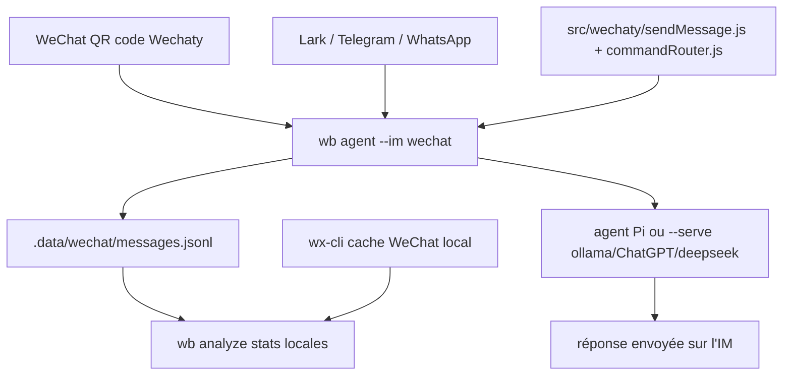

# wangrongding/wechat-bot

> Passerelle CLI qui relie WeChat, Lark, Telegram et WhatsApp à des modèles de langage.

## Le problème
Brancher un modèle sur une messagerie suppose un connecteur par plateforme, chacun avec son mode de réception.
Et un bot naïf répond à tous les messages, ce qui le rend inutilisable en groupe.

## Ce que ça fait vraiment
Route les messages entrants — WeChat par QR code via Wechaty, événements Lark, long-polling Telegram Bot API, webhook WhatsApp Cloud API — vers ChatGPT, DeepSeek, Ollama, Claude ou Pi.
Déclencheurs stricts par conception : `ALIAS_WHITELIST` en privé, `ROOM_WHITELIST` plus mention de `BOT_NAME` en groupe, préfixe facultatif.
Accède au cache WeChat local par `wx-cli` (`wb wx sessions|history|members|stats|favorites|sns-feed`) et capture les messages en JSONL.
Analyse un groupe ou un ami (`wb analyze --room ... --stats-only` local, ou `--serve` pour une analyse par modèle).

## Comment c'est branché


## Essayer
```sh
npm i
cp .env.example .env
npm link
wb agent --im wechat --agent pi
wb wx init
wb analyze --room "Group name" --stats-only
npm run test:analysis
docker build . -t wechat-bot
docker run -d --rm --name wechat-bot -v $(pwd)/.env:/app/.env wechat-bot
```

## Coût et pièges
Node ≥ 18, plus la clé et le solde du fournisseur choisi si vous n'êtes pas sur Ollama ou Pi local.
Le README est explicite : le protocole web WeChat fait risquer avertissement ou bannissement du compte, l'auteur du protocole `padlocal` ne le maintient plus, et `wechaty` lui-même n'est pas activement maintenu.

## Ce que ce n'est pas
Pas un bot officiel : côté WeChat, c'est un protocole non supporté, avec risque de compte assumé par l'utilisateur.
Pas automatique : sans listes blanches et sans mention, rien ne se déclenche — c'est voulu.
Pas multimodal : les messages non textuels ne partent pas dans le pipeline de réponse.

## Alternatives
- gpt4free, chatanywhere : plateformes d'API citées comme sources de modèles, pas des substituts au bot.
- prm-cli : bascule de registre npm, utilitaire annexe.

## Pour toi
À écarter : le risque de bannissement et une dépendance non maintenue ne se justifient pas pour un usage pro.
