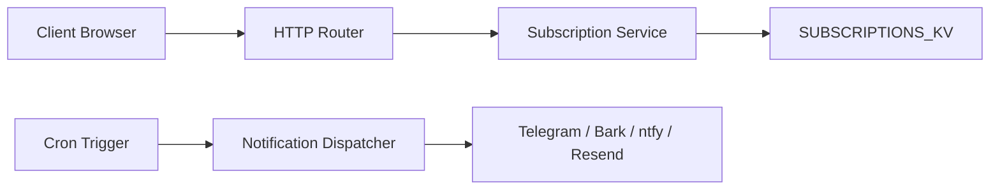

# wangwangit/SubsTracker

> Application personnelle sur Cloudflare Workers qui rappelle les échéances d'abonnements via dix canaux de notification.

## Le problème
Les abonnements, domaines et cartes prépayées arrivent à échéance sans qu'on y pense, et les renouvellements passent inaperçus.

## Ce que ça fait vraiment
- Interface web pour gérer les abonnements : périodes, montants, catégories, calendrier lunaire, renouvellement, historique de paiements.
- Un cron horaire vérifie les règles de rappel (à N jours exactement, le jour même, après échéance) et évite les doublons.
- Envoi vers Telegram, Bark, ntfy, WeChat Work, e-mail Resend, Webhook, etc., avec journaux d'envoi et de planification.
- Données dans Workers KV ; export et import JSON.

## Comment c'est branché


## Essayer
```bash
git clone https://github.com/wangwangit/SubsTracker.git
cd SubsTracker
npm install
export CLOUDFLARE_API_TOKEN=votre_token
npm run deploy:safe
```

## Coût et pièges
Compte Cloudflare et jeton d'API requis. Identifiants par défaut `admin` / `password` à changer immédiatement, sinon l'instance exposée peut être prise en main. README en chinois.

## Ce que ce n'est pas
Ni un outil multi-utilisateur ni un flux d'approbation d'entreprise (le README le dit). Ce n'est pas un gestionnaire de budget complet. Un rappel « 7 jours » ne se déclenche qu'à J-7 exact.

## Alternatives
Aucune alternative nommée dans le README.

## Pour toi
Surveiller : utile comme petit outil perso auto-hébergé, sans lien avec la data ; dépendance à Cloudflare et documentation en chinois à peser.

