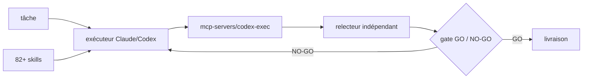

# wanshuiyin/Auto-claude-code-research-in-sleep

> Méthode de recherche autonome où un agent exécute et un second modèle relit.

## Le problème
Un agent qui s'auto-évalue valide ses propres erreurs ; il faut un relecteur qui ne
partage pas son contexte.

## Ce que ça fait vraiment
Le README décrit une méthodologie plutôt qu'un produit : l'exécuteur travaille, un
modèle indépendant (Codex par défaut) joue le relecteur, et des « gates » de design
et d'implémentation doivent passer au vert avant livraison. Livré comme un lot de
82–83 skills installables dans Claude Code, Codex CLI, Cursor, Copilot CLI et
d'autres, plus un CLI autonome ARIS-Code et des plugins. L'essentiel du README est
un journal de versions très détaillé (v0.4.5 à v0.4.27) : bascule du relecteur vers
un pont `codex exec` après la suppression de `codex mcp-server` en codex-cli 0.154,
repli de disponibilité de modèle en chaîne, repliement de la sortie des outils,
correctifs de streaming UTF-8 multi-octets, négociation de version MCP.

## Comment c'est branché


## Essayer
```bash
npx skills add wanshuiyin/Auto-claude-code-research-in-sleep
```

## Coût et pièges
Deux modèles tournent sur chaque tâche, et les gates font plusieurs tours : le coût
par tâche est un multiple d'un agent seul. Dépend d'abonnements tiers (ChatGPT pour
Codex, Claude) et casse quand un CLI amont change — c'est exactement ce que raconte
le changelog. Aucune licence déclarée.

## Ce que ce n'est pas
Pas un framework stable : un dépôt piloté par une personne, au rythme de 23 versions
en quelques mois, dont le README est à 90 % un journal de correctifs. Le README est
tronqué avant la fin. Les verdicts de gate cités sont auto-rapportés.

## Alternatives
- ARIS-Code CLI : la même méthode packagée en CLI autonome, même auteur.

## Pour toi
L'idée « exécuteur + relecteur indépendant avec gate » est bonne à voler ; le dépôt
lui-même est trop instable et trop cher à faire tourner. Ignorer.
