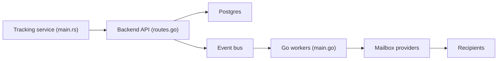

# warmbly/warmbly

> Plateforme auto-hébergée de campagnes d'e-mails à froid avec chauffe de boîtes mail, CRM et boîte unifiée.

## Le problème
Envoyer des e-mails à froid depuis ses propres boîtes sans finir en spam suppose plusieurs outils : séquences, chauffe, suivi de réponses, délivrabilité.

## Ce que ça fait vraiment
Campagnes en plusieurs étapes avec plafonds et espacement par boîte, boîte de réception unifiée, CRM (contacts, pipelines, affaires), chauffe via un pool de boîtes surveillées, suivi des rebonds et plaintes, automatisations visuelles avec étapes IA, intégrations (HubSpot, Slack, Zapier, API REST, webhooks). Un plan de contrôle (API, consommateur, Postgres, Redis, bus d'événements) détient l'état ; des workers Go interchangeables envoient et synchronisent, sans toucher à Postgres. Les secrets sont chiffrés (clé AES locale ou AWS KMS).

## Comment c'est branché


## Essayer
```bash
curl -fsSL https://warmbly.com/install.sh | sh
git clone https://github.com/warmbly/warmbly && cd warmbly
make dev
make up
make doctor
```

## Coût et pièges
Docker avec Compose v2 ; environ 10 Go de disque pour une compilation locale. `make dev` et `make up` partagent une base : ne pas mélanger développement et auto-hébergement sur la même machine. Un envoi massif à froid expose à des règles anti-spam.

## Ce que ce n'est pas
Pas un simple outil de newsletter : il vise la prospection à froid et la chauffe de boîtes, usage qui peut enfreindre les règles de fournisseurs ou la réglementation. Le projet date de janvier 2026.

## Alternatives
Aucune alternative nommée dans le README (HubSpot, Slack et Zapier y sont des intégrations).

## Pour toi
À surveiller : l'architecture contrôle/exécution est instructive et l'auto-hébergement est simple, mais le sujet est de la prospection commerciale, loin du MLOps.

