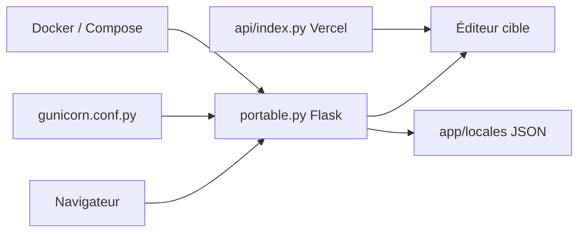

# wasi-master/13ft

> Serveur Flask auto-hébergé qui récupère des articles à paywall en se présentant comme le robot de Google.

## Le problème
Certains articles de presse ou de blog sont masqués derrière un paywall ou saturés de publicités. Le README cible Medium et le New York Times pour la lecture ponctuelle d'un seul article.

## Ce que ça fait vraiment
- Une application Flask (`app/portable.py`) reçoit une URL cible, soit saisie dans une page d'accueil, soit ajoutée au chemin (`/<url>`).
- Elle demande la page en s'identifiant comme Googlebot, puis essaie d'autres sources de repli si cela échoue.
- Une page d'attente s'affiche pendant la récupération.
- Aucune base de données ni authentification : l'interface est locale et minimale, traduite via `LOCALE` (en, de, fr, ko).

## Comment c'est branché


## Essayer
```bash
git clone https://github.com/wasi-master/13ft.git
cd 13ft
docker compose up
# ou, sans Docker :
cd app/
python -m pip install -r requirements.txt
python portable.py
```

## Coût et pièges
Gratuit, rien à payer. Le succès dépend entièrement du site cible (détection de robots, changements de balisage), donc des résultats variables.

## Ce que ce n'est pas
Ce n'est pas un moyen garanti d'accès : les éditeurs peuvent le bloquer. Contourner un paywall peut contrevenir aux conditions d'utilisation du site ; l'auteur lui-même invite à soutenir les créateurs. Ce n'est pas un outil d'archivage.

## Alternatives
- 12ft.io : service hébergé similaire, mais moins compatible selon le README.

## Pour toi
Ignorer : outil de contournement d'accès sans lien avec la donnée ou le MLOps, et aux conditions d'usage discutables.

