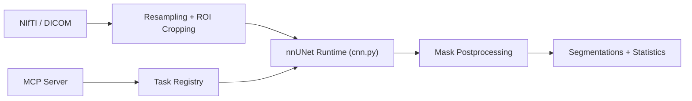

# wasserth/TotalSegmentator

> Segmentation automatique des structures anatomiques sur images CT et IRM, en ligne de commande ou API Python.

## Le problème
Délimiter organes, os et vaisseaux sur des examens 3D à la main est long ; il faut un modèle qui généralise à des scanners et protocoles variés.

## Ce que ça fait vraiment
Modèles nnU-Net entraînés sur 1 228 CT et 616 IRM. La tâche par défaut `total` segmente 117 classes (50 en IRM), avec de nombreuses sous-tâches (poumons, foie, dents, cerveau, muscles…). Entrées NIfTI ou DICOM ; sorties NIfTI ou DICOM. Options `--fast`, `--roi_subset`, statistiques, radiomics. Rapports aorte, artère pulmonaire, colonne. Un serveur MCP est fourni. Poids téléchargés automatiquement.

## Comment c'est branché


## Essayer
```bash
pip install TotalSegmentator
TotalSegmentator -i ct.nii.gz -o segmentations
TotalSegmentator -i mri.nii.gz -o segmentations --task total_mr
totalseg_info --list-tasks
```

## Coût et pièges
Gratuit pour les tâches ouvertes (Apache-2.0). Plusieurs tâches (cœur haute résolution, os appendiculaires, tissus, cerveau) exigent une licence : gratuite en non commercial, payante sinon ; `brain_aneurysm` est en CC BY-NC sans licence commerciale. Statistiques d'usage anonymes envoyées, désactivables. GPU conseillé ; sur CPU utiliser `--fast`.

## Ce que ce n'est pas
Pas un dispositif médical, dit le README, même s'il entre dans des produits certifiés FDA. Cité obligatoire des articles.

## Alternatives
Non documenté dans le README (le projet s'appuie sur nnU-Net).

## Pour toi
Surveiller : très bon en imagerie médicale, mais les licences par tâche et le domaine clinique le réservent à un besoin précis.
