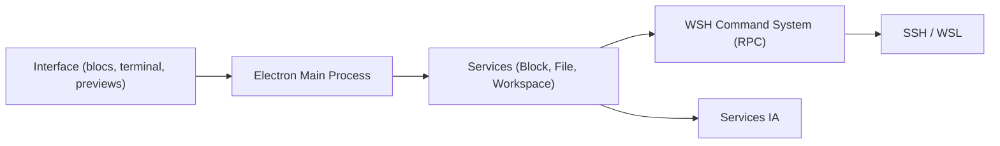

# wavetermdev/waveterm

> Terminal graphique open source avec assistant IA et sessions SSH durables, pour macOS, Linux et Windows.

## Le problème
Les terminaux classiques séparent shell, éditeur distant, aperçu de fichiers et assistant IA. Les sessions SSH tombent à chaque coupure réseau.

## Ce que ça fait vraiment
Une application de bureau Electron avec un backend Go et une base SQLite. Elle organise des « blocs » glissables (terminal, éditeur, navigateur, IA, aperçus de fichiers distants). Les sessions SSH se reconnectent automatiquement. Wave AI lit la sortie du terminal et modifie des fichiers avec approbation. Les modèles se branchent avec ses propres clés (OpenAI, Claude, Gemini) ou en local via Ollama et LM Studio. Une commande `wsh` pilote l'espace de travail.

## Comment c'est branché

## Essayer
Le README renvoie au téléchargement sur www.waveterm.dev/download et à la doc d'installation par plateforme ; aucune commande n'y figure.

## Coût et pièges
Gratuit ; sans compte. Les clés d'API des modèles sont à ta charge, sauf des crédits IA inclus pendant la bêta gratuite. Prérequis minimum : macOS 11, Windows 10 1809, glibc 2.28.

## Ce que ce n'est pas
L'exécution de commandes par l'IA est « bientôt » et pas encore là. Le schéma d'architecture fourni est une description générique, pas un relevé du code.

## Alternatives
Aucune alternative citée dans le README.

## Pour toi
Surveiller : pratique pour travailler sur des machines GPU distantes avec assistance IA locale, mais reste un outil de confort, pas une brique du pipeline.

