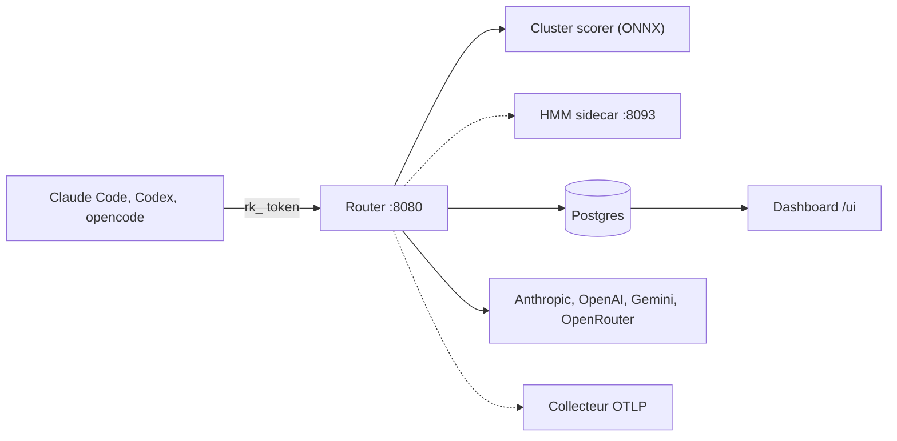

# weave-os/router

> Proxy LLM qui choisit un modèle par requête pour Claude Code, Codex, opencode ou ton appli.

## Le problème
Envoyer chaque requête d'agent au même gros modèle coûte cher ; choisir le modèle à la main, action par action, est impraticable.

## Ce que ça fait vraiment
Point d'entrée unique sur `localhost:8080` qui parle Anthropic Messages, OpenAI Chat Completions et Gemini natif, streaming et outils compris.
Pour chaque requête amont, un scoreur par clusters (dérivé d'Avengers-Pro) calcule un embedding avec un modèle ONNX local et choisit parmi les fournisseurs activés ; politique HMM optionnelle en sidecar.
Clés fournisseurs chiffrées dans Postgres (BYOK), clés `rk_` côté clients, traces OTLP, tableau de bord `/ui`.
L'installeur `npx` modifie la config de Claude Code, Codex, opencode ou pi, avec commandes on/off.

## Comment c'est branché


## Essayer
```bash
npx @weave-os/router
npx @weave-os/router --local
echo "OPENROUTER_API_KEY=sk-or-v1-..." >> .env.local
echo "ROUTER_ADMIN_PASSWORD=replace-with-a-strong-password" >> .env.local
make full-setup
curl -sS http://localhost:8080/v1/route -H "Authorization: Bearer rk_..." -d '...'
```

## Coût et pièges
Le démarrage rapide pointe vers le routeur **hébergé** par Weave : tes requêtes passent alors par leur infrastructure. En auto-hébergé : Postgres via Docker, une clé fournisseur (OpenRouter conseillé), Pub/Sub dès plusieurs réplicas, clé Google pour le HMM.

## Ce que ce n'est pas
Pas neutre pour tes outils : l'installeur réécrit `~/.codex/config.toml`, `opencode.json` ou `settings.json`.
Le support Cursor est annoncé en bêta précoce.
README tronqué : les réglages avancés ne sont pas couverts ici.

## Alternatives
Aucune alternative nommée dans le README.

## Pour toi
Intéressant pour réduire la facture d'agents de code, mais en auto-hébergé ; mesure la qualité perdue avant de généraliser.
