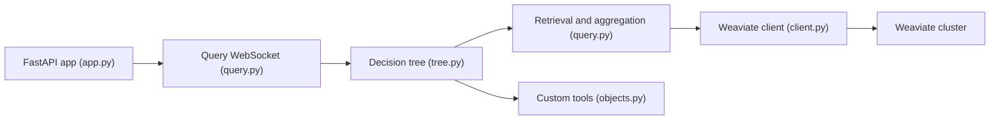

# weaviate/elysia

> Plateforme d'agent à arbre de décision qui interroge des collections Weaviate, pour équipes RAG.

## Le problème
Les agents donnant accès à tous les outils à chaque étape se perdent ; interroger ses données vectorielles en langage naturel exige beaucoup d'assemblage.

## Ce que ça fait vraiment
Un arbre de nœuds prédéfinis est piloté par un agent de décision qui voit l'historique et choisit l'outil suivant. Outils intégrés : requête et agrégation Weaviate, découpage, texte, visualisation, résumé ; outils personnalisés via `@tool`. Une application FastAPI avec WebSocket sert le front-end ; DSPy gère les appels aux modèles. Les collections doivent être prétraitées ; la configuration est par utilisateur.

## Comment c'est branché


## Essayer
```bash
pip install elysia-ai
elysia start
```

## Coût et pièges
Python 3.12 recommandé ; clés d'API de modèle (OpenRouter conseillé, OpenAI pour le vectoriseur) et cluster Weaviate (local ou cloud). Les petits modèles locaux peuvent expirer sur les longs contextes. Projet en bêta, entretien « pas au niveau d'un logiciel de production » selon Weaviate.

## Ce que ce n'est pas
Pas un framework d'agents généraliste : il est taillé pour Weaviate. Pas garanti maintenu rigoureusement.

## Alternatives
Aucune alternative nommée dans le README.

## Pour toi
À surveiller : intéressant si tu utilises déjà Weaviate pour du RAG, mais en bêta et peu actif depuis février 2026.

