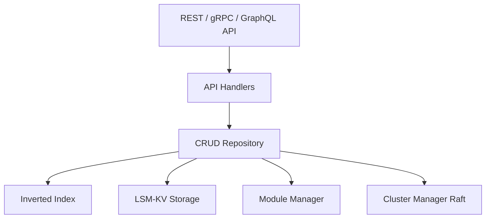

# weaviate/weaviate

> Base vectorielle open source en Go : recherche hybride, RAG intégré, multi-tenant.

## Le problème
Un RAG en production exige de stocker objets et vecteurs, de filtrer, de mêler BM25 et similarité, et de passer à l'échelle.

## Ce que ça fait vraiment
Elle stocke objets et vecteurs. La vectorisation se fait à l'import par modules (OpenAI, Cohere, HF, Model2Vec…), ou on fournit ses propres vecteurs.
Recherche hybride BM25 + vecteurs, images, reranking et génération (RAG) intégrés.
Multi-tenancy, réplication Raft, RBAC, quantification et TTL par objet.
Elle expose des API REST, gRPC et GraphQL, avec des clients Python, JS, Java, Go et C#.

## Comment c'est branché


## Essayer
```bash
docker compose up -d
pip install -U weaviate-client
npx skills add weaviate/agent-skills
```

## Coût et pièges
Elle est gratuite en auto-hébergement, et Weaviate Cloud est payant. Les vectoriseurs externes (OpenAI…) ajoutent leur propre facture.

## Ce que ce n'est pas
Ce n'est pas une bibliothèque embarquée : c'est un serveur à exploiter. GitHub n'identifie pas la licence.

## Alternatives
Le README ne nomme aucune base concurrente. Il cite Verba et Elysia, deux démos du même éditeur.

## Pour toi
À adopter : c'est une base vectorielle mûre, avec recherche hybride et vectorisation locale via Docker Compose. Un choix sûr pour tes RAG.
