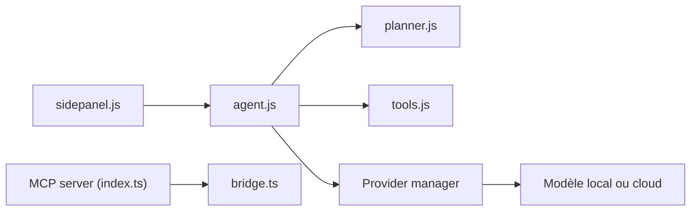

# webbrain-one/webbrain

> Extension de navigateur qui place un agent IA dans un panneau latéral pour lire, discuter et automatiser des pages.

## Le problème
Un agent sans navigateur connecté démarre déconnecté et bute sur les écrans de login ; interroger une page oblige à copier-coller.

## Ce que ça fait vraiment
Panneau latéral avec trois modes : Ask (lecture seule), Act (clics, saisie, téléversement) et Dev (source, réseau, modifications réversibles). Lit les pages par l'arbre d'accessibilité, planifie avant d'agir, enchaîne jusqu'à 195 étapes, enregistre des workflows réutilisables, planifie des tâches et surveille des pages. Modèle au choix : serveur local (llama.cpp, Ollama, vLLM), cloud (106 fiches de fournisseurs) ou modèle par défaut géré. Un serveur MCP délègue des tâches depuis Claude Code, Codex ou Cursor.

## Comment c'est branché


## Essayer
```bash
git clone https://github.com/webbrain-one/webbrain.git
npm run build:chrome
claude mcp add --transport stdio webbrain -- npx -y @webbrain/mcp-server
```

## Coût et pièges
Le modèle par défaut (Compass 1.0) ne demande pas de clé ; les API cloud sont à ta charge. Les modèles locaux exigent au moins 16 k tokens de contexte. Firefox est « nettement plus faible » que Chrome ; le pont MCP ne fonctionne que sous Chromium.

## Ce que ce n'est pas
Pas un framework headless : il tourne dans ton navigateur réel, avec tes sessions ouvertes, ce qui élargit la surface de risque. Licence non identifiée par GitHub. Le README renvoie à un document sur les failles connues de défense contre l'injection de prompt.

## Alternatives
Aucune alternative nommée dans le README.

## Pour toi
À surveiller : intéressant pour automatiser des tâches web authentifiées avec un modèle local, mais licence floue et agent doté de tes sessions : à cantonner au mode Ask au début.

