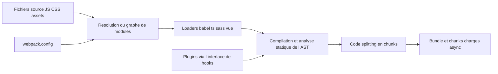

# webpack/webpack

> **JavaScript module bundler** for the front end, highly configurable, built on loaders and plugins.

## The problem

Without a bundler, a browser has to fetch dozens of separate files, and module formats do not
mix well: ES Modules, CommonJS and AMD do not run as-is in a browser. TypeScript, Sass, Pug or
images also need transforming before they ship.

## What it actually does

Webpack walks a dependency graph, resolves everything at compile time, and emits a single
bundle or several chunks loaded asynchronously at runtime. It handles ES Modules, CommonJS and
AMD, even combined, by doing static analysis on the AST of your code — the README even mentions
an evaluation engine for simple expressions.

It does not transform languages itself: **loaders** (babel-loader, ts-loader, sass-loader,
vue-loader, svelte-loader…) preprocess files, and **plugins** extend the rest. JavaScript, JSON
and assets need no loader; CSS and HTML have built-in support that the README explicitly calls
experimental. On output it deduplicates frequently used modules, minifies, and hashes chunk
names for cache friendliness.

## How it is wired



The configuration declares entry points and maps loaders onto files by regular expression —
the README also notes the historical `loadername!` prefix inside a `require()` call. Most of
webpack's own features go through its plugin interface. Internal file names are not documented
in the README.

## Trying it

```bash
npm install --save-dev webpack
```

```bash
yarn add webpack --dev
```

The README documents no run command and no minimal configuration: it points to the *Get
Started* guide on webpack.js.org.

## Cost and traps

Free, MIT, funded by sponsors through OpenCollective. Node.js is required. Browser support
stops at ES5-compliant engines (IE8 and below excluded), and `import()` and `require.ensure()`
need `Promise`, so older browsers need a polyfill. The README itself admits webpack "isn't
always the easiest entry-level solution": the real cost is the configuration and the loader
chain you then maintain. Since built-in CSS and HTML support is experimental, plugins remain
necessary in practice. Stated release cadence: patches as soon as possible, minor releases
every 4 weeks on Thursday.

## What it is not

It is not a transpiler: without babel-loader or ts-loader, webpack will not turn your
TypeScript into JavaScript. It is not a dev server nor a framework — the README describes it as
a low-level tool, often layered beneath other tools. And it is not a zero-config tool: the
flexibility it advertises is paid for in config files.

## Alternatives

- **parcel-bundler/parcel** — a competing bundler, preferable if you want to avoid writing a
  configuration; it is not named in the README, it comes from the catalogue neighbours.
- **evanw/esbuild** — a bundler written in Go, much faster on simple chains, but with a loader
  and plugin ecosystem nowhere near webpack's.
- The other supplied neighbours (phcode-dev/phoenix, airbnb/javascript) are not comparable.

## For you

Little direct bearing on a data or MLOps pipeline, unless you ship a web interface on top of
your models: a dashboard, a demo, an internal tool. In that case it is the brick you meet by
inheritance rather than by choice, since most front-end frameworks sit it under their own
tooling. Worth knowing, not worth studying in depth.
