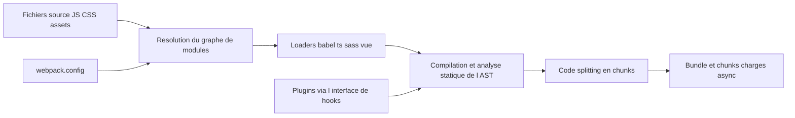

# webpack/webpack

> **Empaqueteur de modules JavaScript** pour front-end, très configurable, à base de loaders et de plugins.

## Le problème

Sans empaqueteur, un navigateur doit charger des dizaines de fichiers séparés, et les formats
de modules cohabitent mal : ES Modules, CommonJS et AMD ne s'exécutent pas tels quels côté
navigateur. Il faut aussi transformer TypeScript, Sass, Pug ou des images avant livraison.

## Ce que ça fait vraiment

Webpack lit un graphe de dépendances, résout tout à la compilation, et produit un seul bundle
ou plusieurs chunks chargés de façon asynchrone à l'exécution. Il combine ES Modules, CommonJS
et AMD, y compris mélangés, en faisant de l'analyse statique sur l'AST du code — le README
mentionne même un moteur d'évaluation d'expressions simples.

Il ne transforme pas lui-même les langages : ce sont les **loaders** (babel-loader, ts-loader,
sass-loader, vue-loader, svelte-loader…) qui prétraitent les fichiers, et les **plugins** qui
étendent le reste. JavaScript, JSON et les assets ne demandent aucun loader ; CSS et HTML ont
un support intégré que le README qualifie explicitement d'**expérimental**. Côté sortie, il
déduplique les modules fréquents, minifie, et hache les noms de chunks pour le cache.

## Comment c'est branché



La configuration désigne les entrées et associe des loaders aux fichiers par expression
régulière — le README note aussi la syntaxe historique de préfixe `loadername!` dans un
`require()`. La plupart des fonctionnalités de webpack lui-même passent par son interface de
plugins. Les noms de fichiers internes ne sont pas documentés dans le README.

## Essayer

```bash
npm install --save-dev webpack
```

```bash
yarn add webpack --dev
```

Le README ne documente aucune commande d'exécution ni de configuration minimale : il renvoie
au guide *Get Started* du site webpack.js.org.

## Coût et pièges

Gratuit, MIT, financé par des sponsors via OpenCollective. Il faut Node.js. Le support
navigateur s'arrête aux moteurs conformes ES5 (IE8 et antérieurs exclus), et `import()` comme
`require.ensure()` exigent `Promise` — donc un polyfill pour les vieux navigateurs. Le README
admet lui-même que webpack « n'est pas toujours la solution la plus facile » pour débuter :
le coût réel est la configuration et la chaîne de loaders à maintenir. Le support intégré CSS
et HTML étant expérimental, des plugins restent nécessaires en pratique. Rythme de publication
annoncé : correctifs dès que possible, versions mineures toutes les 4 semaines le jeudi.

## Ce que ce n'est pas

Ce n'est pas un transpileur : sans babel-loader ou ts-loader, webpack n'écrit pas votre
TypeScript en JavaScript. Ce n'est pas un serveur de développement ni un framework — le README
le décrit comme un outil de bas niveau, souvent posé sous d'autres outils. Et ce n'est pas un
outil sans configuration : la flexibilité annoncée est le prix à payer en fichier de config.

## Alternatives

- **parcel-bundler/parcel** — empaqueteur concurrent, à préférer si vous voulez éviter d'écrire
  une configuration ; il n'est pas cité par le README, il vient des voisins du catalogue.
- **evanw/esbuild** — bundler écrit en Go, bien plus rapide sur des chaînes simples, mais avec
  un écosystème de loaders et de plugins sans commune mesure avec celui de webpack.
- Les autres voisins fournis (phcode-dev/phoenix, airbnb/javascript) ne sont pas comparables.

## Pour toi

Peu de rapport direct avec un pipeline data ou MLOps, sauf si vous livrez une interface web
au-dessus de vos modèles : dashboard, démo, outil interne. Dans ce cas c'est la brique que
vous croiserez par héritage plus que par choix, puisque la plupart des frameworks front la
posent sous leur propre outillage. À connaître, pas à apprendre en profondeur.
