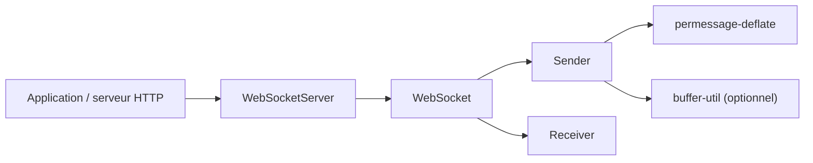

# websockets/ws

> Client et serveur WebSocket pour Node.js, testés avec la suite Autobahn.

## Le problème
Node.js n'a pas de serveur WebSocket dans sa bibliothèque standard, et les navigateurs ne peuvent pas jouer le rôle de serveur.

## Ce que ça fait vraiment
Client et serveur WebSocket côté Node uniquement (pas dans le navigateur). Prend en charge la compression `permessage-deflate` (désactivée par défaut côté serveur, avec coût en mémoire), l'authentification à l'upgrade, plusieurs serveurs sur un même serveur HTTP, la diffusion, les battements de cœur et le mode flux Node. Modules natifs optionnels : `bufferutil` et `utf-8-validate`.

## Comment c'est branché


## Essayer
```bash
npm install ws
npm install --save-optional bufferutil
```
```js
import { WebSocketServer } from 'ws';
const wss = new WebSocketServer({ port: 8080 });
```

## Coût et pièges
Gratuit. La compression peut provoquer une fragmentation mémoire sous forte charge : la tester avec ton profil réel. Passage par un proxy via un agent HTTP tiers.

## Ce que ce n'est pas
Ce n'est pas un client de navigateur (utiliser l'objet natif `WebSocket`). Il n'apporte ni reconnexion ni salles.

## Alternatives
- isomorphic-ws : encapsulation qui rend le code compatible Node et navigateur.

## Pour toi
Surveiller : brique standard si tu diffuses des jetons d'un modèle depuis un service Node ; en Python, d'autres bibliothèques suffiront.

