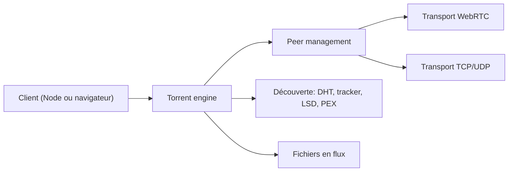

# webtorrent/webtorrent

> Client BitTorrent en JavaScript pour Node.js et navigateur, avec lecture en flux via WebRTC.

## Le problème
Distribuer ou lire des fichiers volumineux en pair à pair depuis un navigateur exige un client BitTorrent qui parle WebRTC, sans plugin.

## Ce que ça fait vraiment
Un même paquet npm sert en Node (TCP/UDP) et en navigateur (canaux WebRTC). Il télécharge plusieurs torrents, expose les fichiers comme flux, va chercher les morceaux à la demande pour permettre l'avance rapide, et passe du mode séquentiel au plus rare d'abord. Découverte de pairs par DHT, trackers, LSD et ut_pex, magnets via ut_metadata.

## Comment c'est branché


## Essayer
```bash
npm install webtorrent
npm install webtorrent-cli -g
webtorrent --help
webtorrent magnet_uri
```

## Coût et pièges
Gratuit. Un pair navigateur ne parle qu'aux clients WebTorrent/WebRTC (Desktop, webtorrent-hybrid, Instant.io, Vuze), pas aux pairs TCP/UDP classiques. Le README renvoie encore à Gitter et freenode.

## Ce que ce n'est pas
Ce n'est pas un client universel dans le navigateur ni un service d'hébergement. Aucun usage data/IA n'est décrit.

## Alternatives
- webtorrent-hybrid : ajoute WebRTC à Node pour joindre les pairs navigateur.
- WebTorrent Desktop : client avec interface.

## Pour toi
À ignorer : le pair à pair navigateur n'a aucun lien décrit avec data, IA ou MLOps ; à reconsidérer seulement pour diffuser de gros fichiers sans serveur.

