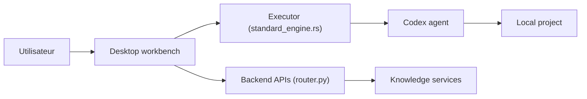

# wecode-ai/Wegent

> Poste de travail IA open source, bureau et web, pour agents de code locaux, distants et en équipe.

## Le problème
Les tâches de code confiées à des agents restent coincées sur une machine ; équipes et appareils ne partagent ni projets ni historique.

## Ce que ça fait vraiment
Wegent Desktop (Electron) organise projets, tâches, fichiers, tests et diffs, et pilote Codex via un Executor. Un Backend partage espaces de projet, modèles et appareils d'exécution ; Wegent Web offre agents, connaissances et administration. Auto-hébergement par Docker. Composants : backend Python et Rust, chat_shell, services de connaissances.

## Comment c'est branché


## Essayer
```bash
curl -fsSL https://raw.githubusercontent.com/wecode-ai/Wegent/main/install.sh | bash -s -- --standalone
pnpm install
pnpm --filter wework dev
```

## Coût et pièges
Modèles à configurer à ta charge ; pile multi-services lourde. Le README ne détaille pas les coûts. Exécution distante : prévoir l'isolement des appareils.

## Ce que ce n'est pas
Pas un nouveau modèle : il orchestre Codex. Le poste de travail repose sur ce moteur, donc sur ses limites.

## Alternatives
Aucune alternative nommée dans le README.

## Pour toi
À surveiller : ambitieux pour un travail d'équipe avec agents de code, mais large et jeune ; évalue sur un projet pilote.

