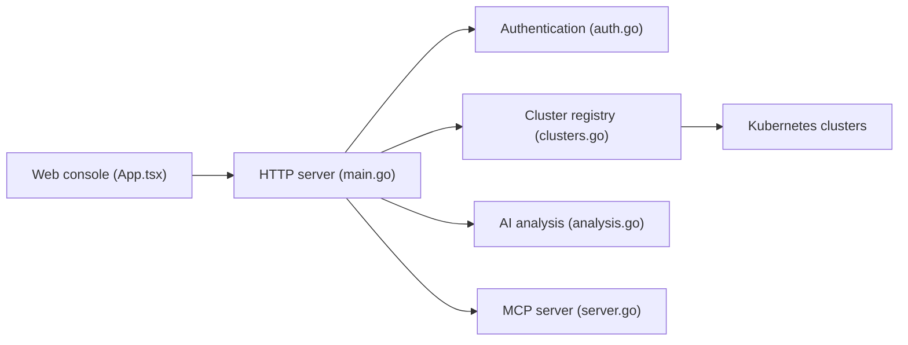

# weibaohui/k8m

> Console Kubernetes légère en un seul exécutable, avec assistance IA et serveur MCP intégré.

## Le problème
Gérer plusieurs clusters demande de jongler entre kubectl, tableaux de bord et outils de diagnostic, sans aide pour interpréter logs et événements.

## Ce que ça fait vraiment
Console web (AMIS) et backend Go dans un binaire : ressources, YAML, fichiers et shell dans les pods, Helm, CRD, inspections planifiées (scripts Lua), transfert d'événements vers webhooks. Fonctions IA : explication, lecture de describe et de logs. Serveur MCP avec 49 outils de cluster, exécutés avec les droits de l'utilisateur appelant. Multi-clusters, droits par utilisateur et groupe.

## Comment c'est branché


## Essayer
```bash
./k8m
# puis http://127.0.0.1:3618 (utilisateur k8m, mot de passe k8m)
```

## Coût et pièges
Identifiants par défaut k8m/k8m et secret JWT par défaut : à changer. L'IA intégrée passe par un modèle ou le vôtre (Ollama possible). README principalement en chinois.

## Ce que ce n'est pas
Pas un outil de MLOps : c'est une console Kubernetes généraliste. Le modèle intégré n'est pas chiffré en performance dans le README.

## Alternatives
Aucune alternative nommée dans le README (k8sgpt est intégré).

## Pour toi
À surveiller : pratique pour explorer des clusters avec aide IA, mais change les mots de passe par défaut et vérifie les droits MCP avant ouverture.

