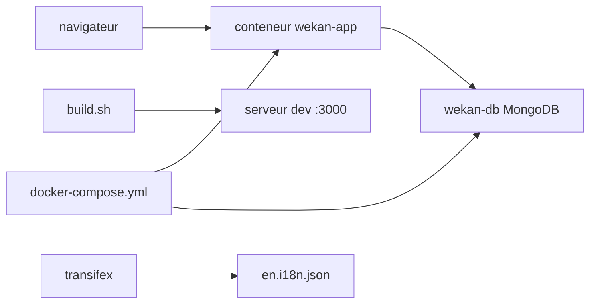

# wekan/wekan

> Tableau kanban collaboratif auto-hébergé, sous licence MIT, pour équipes ou usage personnel.

## Le problème
Les tableaux kanban en SaaS imposent de confier ses données et ses projets à un tiers.
Changer d'outil ou repartir de ses données devient alors une négociation, pas une copie de fichier.

## Ce que ça fait vraiment
Tableaux kanban temps réel, traduits en 234 langues, installables sur ta machine ou ton serveur.
Images publiées sur GitHub Container Registry, Docker Hub et Quay.io, avec un `docker-compose.yml` au dépôt.
Le développement se fait sur Meteor 3.5 / Node.js 24.x via un script `build.sh` à menus.
Les traductions passent exclusivement par Transifex ; seules les chaînes anglaises arrivent en PR.

## Comment c'est branché


## Essayer
```bash
git clone git@github.com:YOUR_USERNAME/wekan.git
cd wekan
chmod +x build.sh
./build.sh
```
Ou en conteneur, avec l'image `ghcr.io/wekan/wekan:latest` et le `docker-compose.yml` du dépôt.

## Coût et pièges
1 Go de RAM libre minimum, 4 Go recommandés en production, et de la place disque surveillée :
MongoDB se corrompt si le disque se remplit. Seule la dernière version est supportée.

## Ce que ce n'est pas
Pas un outil qui pardonne : il n'y a pas d'annulation, une suppression de liste ou de carte est définitive.
Pas un service que tu peux laisser tourner un an sans y toucher — les mises à jour sont des correctifs de sécurité.
Pas non plus un standard complet : 8 critères sur 16 du Standard for Public Code étaient atteints en 2023-11.

## Alternatives
Aucune nommée dans le README.

## Pour toi
Utile si tu veux un kanban chez toi ; sinon c'est de l'exploitation MongoDB en plus, sans lien avec ton métier.
