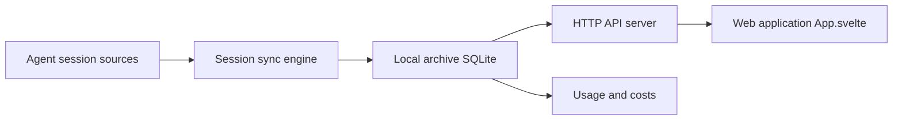

# wesm/agentsview

> Archive locale et tableau de bord des sessions d'agents de code, avec recherche et suivi des coûts en tokens.

## Le problème
Les sessions de Claude Code, Codex ou Copilot sont éparpillées, introuvables, et leur coût est opaque.

## Ce que ça fait vraiment
Découvre les sessions des agents pris en charge, les synchronise dans une base SQLite locale et sert une interface web (FTS5, recherche sémantique optionnelle, heatmaps). `agentsview usage daily` calcule les coûts par modèle avec la tarification LiteLLM/OpenRouter. Peut pousser vers PostgreSQL, ClickHouse ou DuckDB.

## Comment c'est branché


## Essayer
```bash
curl -fsSL https://agentsview.io/install.sh | bash
agentsview serve
agentsview usage daily
```

## Coût et pièges
Gratuit ; il sert sur 127.0.0.1:8080 par défaut. Derrière un tunnel ou proxy, utiliser `--public-url` ; au-delà de loopback, activer `--require-auth`.

## Ce que ce n'est pas
Pas un service cloud : les données restent locales. Un ping anonyme `daily_active` vers PostHog existe, désactivable avec `AGENTSVIEW_TELEMETRY_ENABLED=0`.

## Alternatives
Aucune alternative nommée dans le README.

## Pour toi
À adopter si tu utilises plusieurs agents de code : l'observabilité des coûts et des sessions est directement exploitable, et les données restent chez toi.

