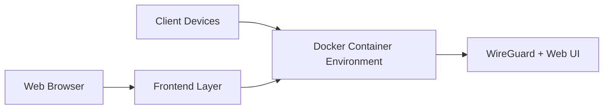

# wg-easy/wg-easy

> Interface web tout-en-un pour installer et gérer un serveur WireGuard sur un hôte Linux.

## Le problème
Configurer WireGuard à la main, créer les clients et distribuer leurs fichiers est fastidieux et source d'erreurs.

## Ce que ça fait vraiment
Conteneur Docker qui embarque WireGuard et une interface web : créer, éditer, activer ou supprimer des clients, afficher leur QR code, télécharger la configuration, voir les clients connectés et les graphiques Tx/Rx. Options citées : liens à usage unique, expiration de client, métriques Prometheus, IPv6, 2FA, filtrage par client (iptables), OIDC (Google, GitHub, Authelia, Authentik).

## Comment c'est branché


## Essayer
```bash
curl -sSL https://get.docker.com | sh
pnpm dev
```
(le déploiement se fait via Docker Compose : le README renvoie à la documentation détaillée)

## Coût et pièges
Gratuit. Il faut Docker et un accès root sur un hôte Linux ; le README conseille un reverse proxy pour exposer l'interface sur Internet. Une migration est nécessaire depuis l'ancienne version. AGPL-3.0.

## Ce que ce n'est pas
Ce n'est pas un VPN managé ni un service cloud. Le diagramme fourni par le code est très sommaire : la structure interne n'est pas documentée ici.

## Alternatives
- Aucune alternative nommée dans le README.

## Pour toi
Surveiller : pratique pour accéder à un serveur GPU ou à un homelab par VPN, mais à n'exposer qu'avec reverse proxy et 2FA.

