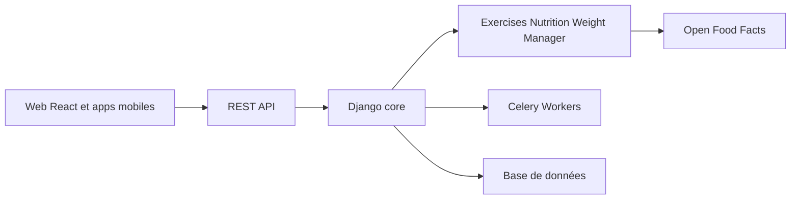

# wger-project/wger

> Gestionnaire libre d'entraînement et de nutrition, auto-hébergeable, avec applications mobiles.

## Le problème
Suivre programmes d'entraînement, poids, mesures et calories sans confier ses données à un service fermé.

## Ce que ça fait vraiment
Application Django : routines avec progression automatique, suivi du poids et des mesures, journal alimentaire adossé à Open Food Facts, galerie de progression, wiki d'exercices, gestion basique de salle de sport, API REST. Tâches asynchrones via Celery, front React, images Docker de production.

## Comment c'est branché


## Essayer
```bash
docker compose up -d
```

## Coût et pièges
Gratuit ; auto-hébergement par Docker Compose (la documentation détaillée est en ligne). Licence AGPL-3.0 : les modifications servies en réseau doivent être publiées.

## Ce que ce n'est pas
Pas un outil de santé médical : c'est un journal de suivi personnel.

## Alternatives
Aucune alternative nommée dans le README.

## Pour toi
À ignorer : application de fitness auto-hébergée, hors du périmètre data/IA/MLOps, sauf si tu veux un exemple de projet Django complet.

