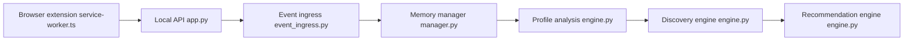

# whiteguo233/OpenBiliClaw

> Agent local de découverte de contenu qui construit un profil psychologique et recommande sur plusieurs plateformes.

## Le problème
Les recommandations de chaque plateforme servent ses objectifs et restent cloisonnées ; tes goûts ne sont jamais croisés d'un site à l'autre.

## Ce que ça fait vraiment
Une extension navigateur capte tes interactions et les envoie à un backend Python local (FastAPI, SQLite). Un moteur de profil à cinq couches (MBTI, traits, besoins) guide la découverte sur B站, Xiaohongshu, Douyin, YouTube, X, Zhihu, Reddit, GitHub, V2EX, etc. Un évaluateur LLM note les candidats, avec sondes d'intérêt, dialogue et retours. Interfaces : web, mobile, extension, client Flutter à part.

## Comment c'est branché


## Essayer
```bash
curl -fsSL https://raw.githubusercontent.com/whiteguo233/OpenBiliClaw/main/scripts/install.sh | bash
openbiliclaw init
openbiliclaw start
openbiliclaw discover
```

## Coût et pièges
Clé LLM à ta charge (ou Ollama local avec bge-m3, ~1,1 Go). Les installateurs macOS/Windows ne sont pas signés ni notarisés. Il faut être connecté aux plateformes dans ton navigateur.

## Ce que ce n'est pas
Pas un service cloud : tout reste local sauf les appels LLM que tu configures. Un export `.obcbackup` n'est pas chiffré.

## Alternatives
Aucune alternative nommée dans le README (comparaison avec recommandations officielles et plugins de filtrage).

## Pour toi
À surveiller : exemple riche d'agent local avec mémoire, mais surtout utile si tu consommes ces plateformes (chinoises en majorité) ; vérifie le niveau de données personnelles manipulées.

