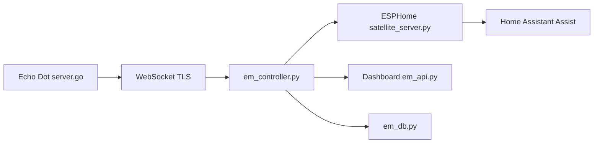

# wilbowes/EchoMuse

> Transforme un Echo Dot 2e génération débloqué en satellite vocal local pour Home Assistant.

## Le problème
Un Echo Dot d'occasion dépend d'Amazon et d'Alexa ; on veut le réutiliser en assistant vocal local.

## Ce que ça fait vraiment
Un firmware Go sur le Dot (ou emOS, un userspace Linux maison) streame l'audio vers un contrôleur Python. Le contrôleur détecte le mot d'activation, gère les appareils, expose le Dot comme satellite ESPHome et lecteur multimédia à Home Assistant (pipeline Assist). Tableau de bord, mises à jour par WiFi, mots d'activation personnalisés (`oww_forge`).

## Comment c'est branché


## Essayer
```bash
mkdir echomuse && cd echomuse
curl -O https://raw.githubusercontent.com/wilbowes/EchoMuse/main/controller/docker-compose.deploy.yml
curl -o .env https://raw.githubusercontent.com/wilbowes/EchoMuse/main/controller/.env.example
docker compose -f docker-compose.deploy.yml up -d
```

## Coût et pièges
Le Dot doit être débloqué par USB sous Linux (amonet-biscuit), avec risque de le briquer. Home Assistant avec Assist requis. Le bouton mute est logiciel. Écrit largement avec Claude, de l'aveu du README ; 145 issues ouvertes.

## Ce que ce n'est pas
Pas Alexa, pas autonome, et seul l'Echo Dot 2 est pris en charge.

## Alternatives
Aucune alternative citée dans le README.

## Pour toi
À surveiller : cas concret de voix locale (openWakeWord, Whisper/Piper) pour ton homelab, si tu as un Dot ; sinon sans intérêt.

