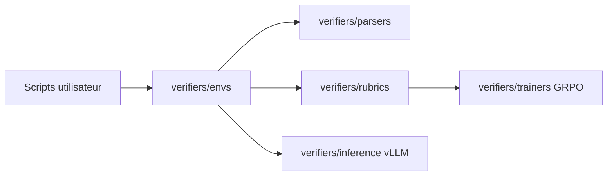

# willccbb/verifiers

> Bibliothèque pour créer des environnements d'entraînement et d'évaluation de LLM, liée à un hub d'environnements.

## Le problème
Entraîner ou évaluer un LLM par renforcement demande des environnements reproductibles avec récompenses vérifiables.

## Ce que ça fait vraiment
README minimal (moins de 800 caractères) : il annonce une bibliothèque d'environnements, intégrée à l'Environments Hub, à prime-rl et à une plateforme d'entraînement hébergée. D'après la description du code : abstractions Environment, Parser, Rubric, un GRPOTrainer et un client vLLM. Le README ne détaille rien de plus.

## Comment c'est branché


## Essayer
```bash
curl -LsSf https://astral.sh/uv/install.sh | sh
uv tool install prime
```

## Coût et pièges
Non documenté dans le README. L'écosystème mentionné (Hosted Training) est une plateforme hébergée, sans tarif indiqué.

## Ce que ce n'est pas
Ce n'est pas documenté ici : le README renvoie aux docs et à AGENTS.md. Ne pas déduire d'API depuis ce texte.

## Alternatives
- prime-rl : le cadre d'entraînement cité par le README, avec lequel verifiers s'intègre.

## Pour toi
À surveiller : sujet pertinent pour le RL sur LLM, mais matière insuffisante et licence non déclarée pour trancher davantage.
