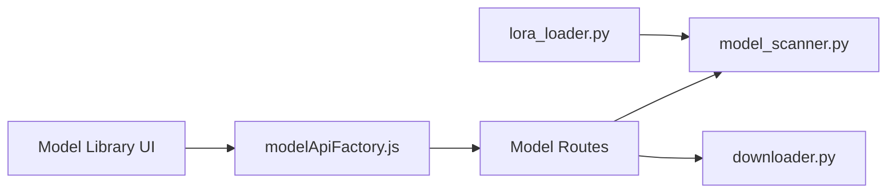

# willmiao/ComfyUI-Lora-Manager

> Extension ComfyUI pour organiser, télécharger et appliquer des LoRA, checkpoints et recettes de génération.

## Le problème
Les collections de LoRA grossissent, leurs mots-clés et forces se perdent, et les retrouver dans un workflow est fastidieux.

## Ce que ça fait vraiment
Interface web (`/loras`) qui scanne les dossiers de modèles, récupère métadonnées et aperçus depuis CivitAI, gère checkpoints et embeddings (autres types en option), enregistre des « recettes » de combinaisons de LoRA. Des nœuds ComfyUI (Lora Loader, Text/Prompt avec wildcards, Save Image avec motifs de nom de fichier) appliquent les réglages. Mode autonome sans ComfyUI.

## Comment c'est branché


## Essayer
```bash
git clone https://github.com/willmiao/ComfyUI-Lora-Manager.git
cd ComfyUI-Lora-Manager
pip install -r requirements.txt
python standalone.py
```

## Coût et pièges
Clé d'API CivitAI nécessaire pour télécharger. Le mode autonome se configure via `settings.json`. 119 issues ouvertes.

## Ce que ce n'est pas
Pas un générateur d'images : il gère les modèles pour ComfyUI. Il dépend de CivitAI pour les métadonnées et les téléchargements. Licence GPL-3.0 (copyleft).

## Alternatives
Aucune alternative nommée dans le README.

## Pour toi
À surveiller : utile seulement si tu utilises ComfyUI avec beaucoup de LoRA ; hors génération d'images, aucun intérêt pour un profil data/MLOps.

