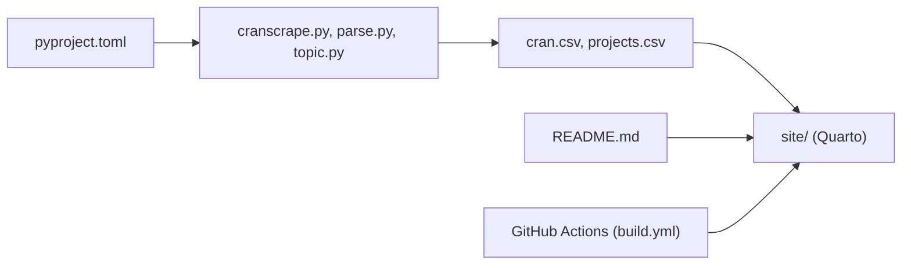

# wilsonfreitas/awesome-quant

> Liste triée de bibliothèques, données et ressources pour la finance quantitative, par langage et thème.

## Le problème
Les outils de finance quantitative sont dispersés entre langages, fournisseurs de données et projets abandonnés, sans point d'entrée unique.

## Ce que ça fait vraiment
Le README classe des centaines d'entrées en rubriques : bibliothèques numériques, pricing, indicateurs techniques, trading et backtesting, portefeuille et risque, séries temporelles, données de marché, marchés de prédiction, calendriers, visualisation, environnements de recherche. Une rubrique regroupe des services commerciaux, une autre les projets historiques. Les descriptions viennent des auteurs des entrées, non vérifiées.

## Comment c'est branché

## Essayer
Aucune commande documentée : le README est la liste elle-même, à parcourir par rubrique.

## Coût et pièges
Gratuit, mais plusieurs entrées mènent à des services payants ou à des API limitées. Aucune licence déclarée. Le catalogue est vaste, avec des entrées anciennes ou sans mise à jour depuis 2015.

## Ce que ce n'est pas
Ce n'est pas une sélection évaluée : les entrées ne sont pas testées et des performances annoncées ne sont pas vérifiables ici. Aucun code exécutable à installer.

## Alternatives
- awesome-sec-filings : liste dédiée aux dépôts SEC (13F, 10-K), citée dans le README.

## Pour toi
À adopter comme carnet d'adresses : gratuit et large sur les séries temporelles, le backtesting et les données de marché, à condition de tester chaque outil avant usage.

