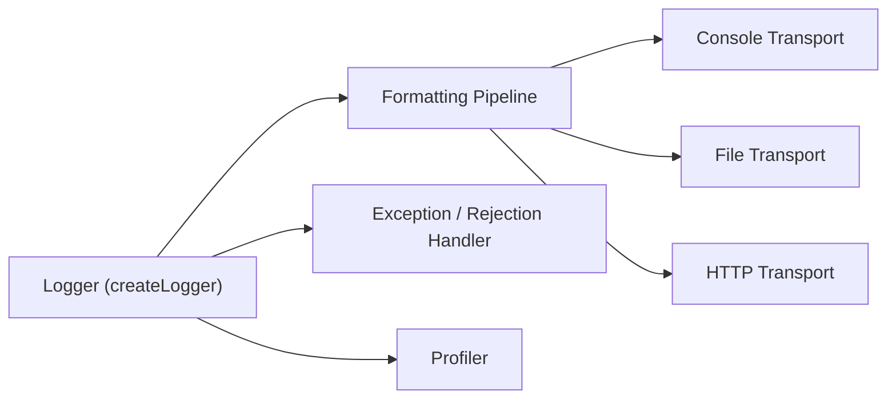

# winstonjs/winston

> Bibliothèque de journalisation Node.js à transports multiples, pour développeurs d'applications et d'API Node.

## Le problème
Envoyer les logs d'une appli Node vers plusieurs destinations, avec des niveaux et des formats différents, sans coder chaque cas.

## Ce que ça fait vraiment
Un logger reçoit des objets `info` (`level`, `message`, métadonnées) et les passe dans des formats (via `logform`) avant de les envoyer vers des transports : console, fichier, HTTP, flux, ou transports communautaires. Niveaux npm ou syslog, niveaux personnalisés, loggers enfants, conteneur de loggers, capture des exceptions et rejets non gérés, profilage, requête sur les logs.

## Comment c'est branché


## Essayer
```bash
npm install winston
npm test
npm run test:unit
```

## Coût et pièges
Gratuit. Le logger par défaut n'a aucun transport : sans transport, le README signale un risque d'usage mémoire élevé. Le `.child` peut poser problème si on étend la classe `Logger`.

## Ce que ce n'est pas
Ce n'est pas un système d'agrégation de logs : il les émet, il ne les stocke ni ne les analyse.

## Alternatives
Aucune alternative nommée dans le README.

## Pour toi
Surveiller : pertinent seulement si tu écris du back-end Node ; en Python data/MLOps il n'apporte rien.

