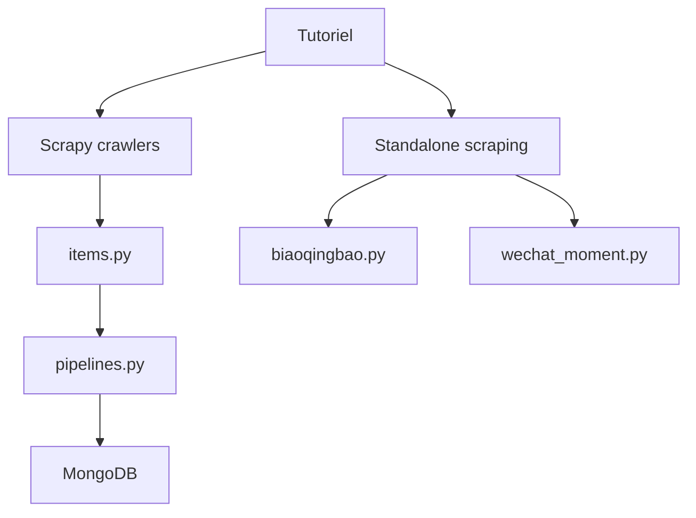

# wistbean/learn_python3_spider

> Série de tutoriels en chinois sur le scraping Python, avec exemples de code, pour débutants.

## Le problème
Apprendre le scraping web de zéro, avec des cas concrets, quand on lit le chinois et qu'on n'a pas de fil conducteur.

## Ce que ça fait vraiment
C'est un index d'articles (urllib, requests, BeautifulSoup, Selenium, Appium, Scrapy, mitmproxy, MongoDB/MySQL) et un recueil d'exemples exécutables, pas une application. Le code d'après le diagramme : deux projets Scrapy (Qiushibaike, Stack Overflow) dont les pipelines écrivent dans MongoDB, des scripts isolés (livres, Douban, mèmes, captcha à glissière, WeChat) et des pages de données de notes du gaokao. Les articles traitent aussi du contournement d'anti-bots et de la rétro-ingénierie JS ; le README renvoie en plus vers un compte WeChat et une mini-app de fitness (promotion).

## Comment c'est branché

## Essayer
Aucune commande documentée dans le README : il ne contient que des liens vers des articles et des sources.

## Coût et pièges
Gratuit, licence MIT. Contenu en chinois, écrit en 2019-2020 ; les sites cibles (Douban, Dangdang, etc.) ont probablement changé leurs pages, donc les exemples peuvent ne plus tourner (non vérifié).

## Ce que ce n'est pas
Ni une bibliothèque installable, ni un framework. Ce n'est pas un projet maintenu comme produit : un ensemble d'exemples d'une personne. Le respect des conditions d'usage des sites visés reste à la charge de qui exécute le code.

## Alternatives
Le README ne cite aucun autre dépôt ; non documenté.

## Pour toi
À ignorer : un profil data/IA lisant peu le chinois trouvera mieux dans la documentation officielle de Scrapy ou de BeautifulSoup, et ces exemples datés servent surtout de support d'apprentissage.

