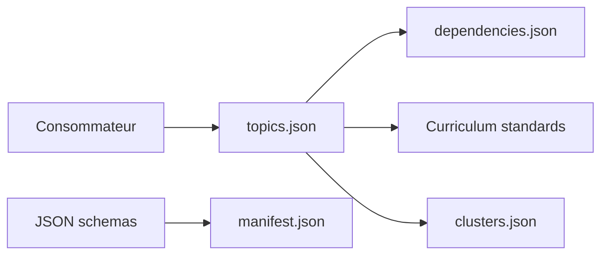

# withmarbleapp/os-taxonomy

> Jeu de données ouvert de 1 590 micro-notions du primaire reliées par prérequis, pour éducation et IA.

## Le problème
Les référentiels scolaires sont des listes plates de standards ou enfermés dans des produits, sans graphe de dépendances exploitable.

## Ce que ça fait vraiment
Fournit en JSON 1 590 micro-notions (description, preuves de maîtrise, type, matière, tranche d'âge, centralité, standards NGSS, Common Core, programme britannique), 3 221 liens de prérequis (forts ou faibles, avec raison), des standards sources et 183 synthèses par domaine. Un script `validate.mjs` contrôle la structure et l'intégrité des références ; des schémas JSON et un manifeste avec sommes SHA-256 accompagnent les données. Pas d'embeddings ni de données d'enfants.

## Comment c'est branché


## Essayer
```bash
node scripts/validate.mjs
```

## Coût et pièges
Gratuit, mais l'attribution est obligatoire (ODbL pour la base, CC BY-SA 4.0 pour le contenu) plus les mentions de PROVENANCE.md. Le champ `assessmentPrompt` contient un `{{name}}` à remplacer.

## Ce que ce n'est pas
Pas une application ni un modèle : le visualiseur interactif n'est pas dans le dépôt. Pas non plus un programme officiel d'un État.

## Alternatives
Aucune alternative nommée dans le README.

## Pour toi
À surveiller : un graphe de prérequis prêt à l'emploi pour un projet de tutorat adaptatif ou de RAG éducatif, à condition d'accepter les clauses de partage à l'identique.

