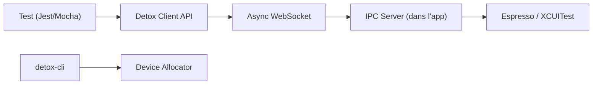

# wix/Detox

> Framework de tests de bout en bout « gray box » pour applications mobiles React Native.

## Le problème
Les tests E2E mobiles sont instables : ils échouent de façon non déterministe.

## Ce que ça fait vraiment
Tes tests en JavaScript pilotent l'appli dans un simulateur ou un appareil via `element()`, `expect()` et `device`. Detox surveille les opérations asynchrones de l'appli pour attendre qu'elle soit inactive. Jest est intégré. D'après le code : un client Node parle par WebSocket à un serveur dans l'appli, qui délègue à Espresso (Android) ou XCUITest (iOS).

## Comment c'est branché

## Essayer
Aucune commande dans le README ; renvoi au Getting Started Guide.

## Coût et pièges
Gratuit. Il faut un simulateur ou émulateur et la chaîne de build native. Le README signale un cas limite de visibilité sur Android. 210 issues ouvertes.

## Ce que ce n'est pas
Pas un outil de test d'API ni de charge ; il vise les applications React Native.

## Alternatives
Aucune alternative nommée dans le README.

## Pour toi
Surveiller : sans application mobile React Native à tester, il n'a pas d'usage pour un profil data/IA/MLOps.

