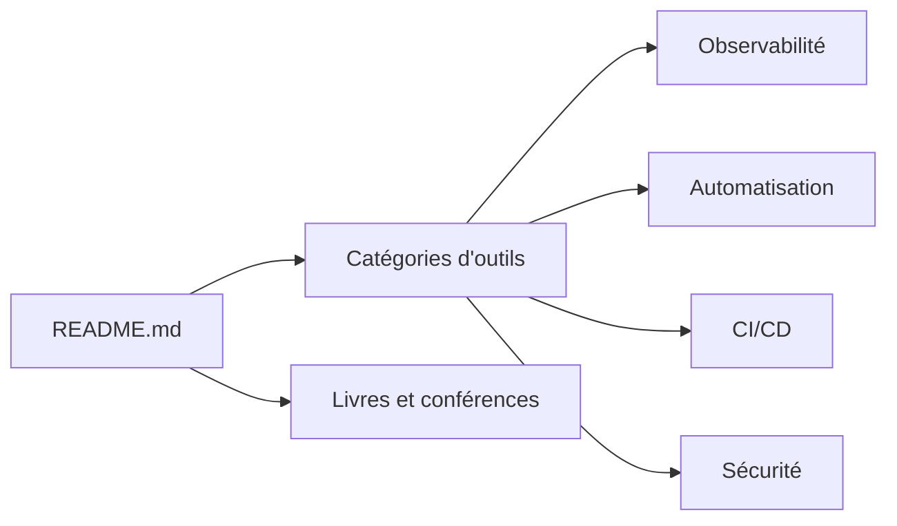

# wmariuss/awesome-devops

> Liste commentée de plateformes, outils et ressources DevOps et SRE, classée par domaine.

## Le problème
L'écosystème DevOps est vaste ; repérer des outils par catégorie sans partir de zéro prend du temps.

## Ce que ça fait vraiment
Un README de liens classés : clouds publics et open source, systèmes, plateformes d'applications, plateformes de développeur internes, registres, automatisation (Terraform, Ansible, Pulumi…), CI/CD, SCM, serveurs web, SSL, bases de données, observabilité, service mesh, chaos engineering, passerelles API, messagerie, secrets, sécurité, VPN, livres et conférences. Chaque entrée a une ligne de description.

## Comment c'est branché


## Essayer
```bash
# Aucune commande documentée : liste à parcourir.
```

## Coût et pièges
Gratuit, licence CC0. Beaucoup d'entrées sont anciennes ou abandonnées (Heka, Phabricator, CoreOS…) sans indication d'état ; certaines lignes sont promotionnelles. 184 issues ouvertes.

## Ce que ce n'est pas
Pas un guide de choix ni un comparatif : les entrées ne sont pas évaluées. Peu de contenu data/ML.

## Alternatives
Non documenté dans le README : aucune alternative nommée.

## Pour toi
Un bon point d'entrée pour retrouver un nom d'outil de CI, d'observabilité ou de secrets en MLOps ; vérifie toujours l'état du projet avant d'en choisir un.

