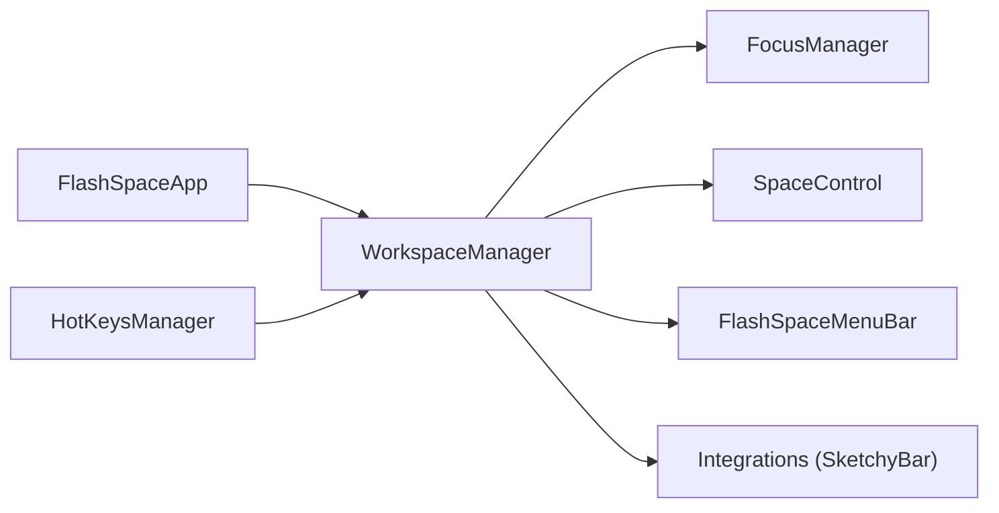

# wojciech-kulik/FlashSpace

> Gestionnaire d'espaces de travail virtuels pour macOS qui remplace les Spaces natifs, pour utilisateurs au clavier.

## Le problème
Les Spaces de macOS imposent des animations et un basculement lent entre groupes d'applications.

## Ce que ça fait vraiment
Tu définis des workspaces, y assignes des apps et un écran. Au changement, les apps assignées s'affichent et les autres apps de l'écran sont masquées. Il ajoute des raccourcis, un sélecteur `Option + Tab`, une vue en grille, des profils et un CLI. Il ne gère pas les fenêtres non assignées.

## Comment c'est branché


## Essayer
```bash
brew install flashspace
flashspace --help
```
Le CLI s'installe depuis les réglages de l'app. Prérequis : macOS 14+ et « Displays have separate Spaces » activé.

## Coût et pièges
Gratuit. Demande la permission Accessibilité. Bug macOS connu : apps sur le mauvais écran après la veille.

## Ce que ce n'est pas
Pas un gestionnaire de fenêtres en mosaïque. Il ne gère pas les fenêtres des apps non assignées, par choix.

## Alternatives
Aucune alternative nommée, hors mentions de Raycast, Magnet et SKHD comme compléments.

## Pour toi
À ignorer côté data/IA : c'est un confort de bureau macOS, sans lien avec ton travail.

