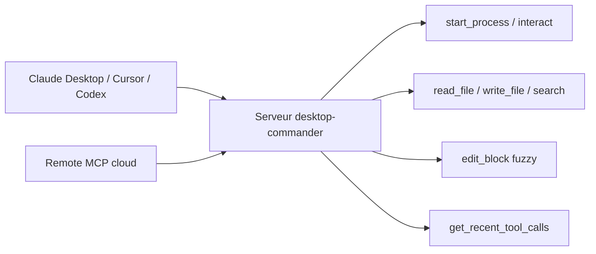

# wonderwhy-er/DesktopCommanderMCP

> Serveur MCP donnant à un assistant l'accès au terminal, aux fichiers et aux processus.

## Le problème
Un assistant de chat ne peut ni lancer un script, ni éditer un fichier en place, ni garder une session
SSH ouverte ; les éditeurs IA qui le font facturent au token d'API.

## Ce que ça fait vraiment
Expose des outils MCP en quatre familles : configuration (`get_config`, `set_config_value`), terminal
(`start_process`, `interact_with_process`, `read_process_output`, gestion des sessions et des processus),
système de fichiers (lecture paginée y compris Excel et PDF, écriture, recherche en flux via ripgrep,
métadonnées) et édition (`edit_block`, remplacements chirurgicaux avec repli en recherche floue et diff
au caractère). Exécute du code en mémoire (Python, Node, R) sans fichier temporaire. Historique local des
appels d'outils, borné par rotation.

## Comment c'est branché


## Essayer
```bash
npx @wonderwhy-er/desktop-commander@latest setup
npx @wonderwhy-er/desktop-commander@latest remove
claude mcp add --scope user desktop-commander -- npx -y @wonderwhy-er/desktop-commander@latest
docker run -i --rm mcp/desktop-commander:latest
```

## Coût et pièges
Gratuit côté serveur : il utilise l'abonnement du client hôte au lieu de jetons d'API. Node.js requis
(sauf en Docker). Un réglage `telemetryEnabled` figure dans la configuration. Le mode Remote MCP fait
transiter les commandes par un service cloud avant exécution locale.

## Ce que ce n'est pas
**Pas un bac à sable** : le README le dit explicitement et renvoie à SECURITY.md. Les garde-fous se
limitent à une liste de commandes bloquées et à la prévention des liens symboliques ; `allowedDirectories`
ne contraint pas les commandes terminal. L'isolation réelle passe par Docker. README tronqué à la source.

## Alternatives
- **Desktop Commander App** : version applicative en bêta, du même auteur, à télécharger séparément.

## Pour toi
Puissant mais dangereux hors Docker : à cantonner à une machine jetable.
