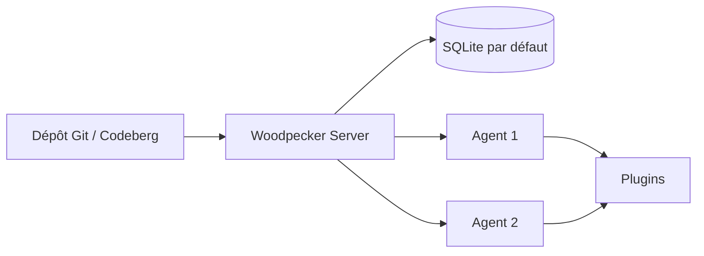

# woodpecker-ci/woodpecker

> Moteur de CI/CD léger et extensible par plugins, utilisé en production par Codeberg.

## Le problème
Les moteurs de CI auto-hébergés demandent souvent une base de données, plusieurs gigaoctets de
RAM et une équipe pour les tenir, ce qui est disproportionné pour un petit hébergement Git.

## Ce que ça fait vraiment
Serveur plus agents, SQLite par défaut, donc aucun service externe à provisionner pour démarrer.
Empreinte annoncée au repos : environ 100 Mo de RAM côté serveur et 30 Mo côté agent.
L'extensibilité passe par des plugins, listés sur un site dédié qui mélange plugins de l'équipe
cœur et contributions communautaires. Traductions gérées sur une instance Weblate auto-hébergée.

## Comment c'est branché


## Essayer
```bash
# Aucune commande documentée dans le README : il renvoie aux « Installation Instructions »
# et au site de documentation du projet.
```

## Coût et pièges
Gratuit et auto-hébergé. Le README ne dit rien de la licence, ni des limites de SQLite à
l'échelle, ni du modèle de sécurité des agents — ce sont pourtant les deux points qui décident
d'une adoption. L'installation elle-même n'est pas décrite ici.

## Ce que ce n'est pas
Ce n'est pas un service hébergé : il n'y a pas d'offre SaaS. Ce n'est pas un remplaçant direct de
GitHub Actions : les plugins ne sont pas les mêmes, et la bibliothèque est plus petite.

## Alternatives
Aucune alternative nommée dans le README.

## Pour toi
Bon candidat pour une CI perso ou d'équipe légère ; peu d'apport si tu es déjà sur GitHub Actions.
