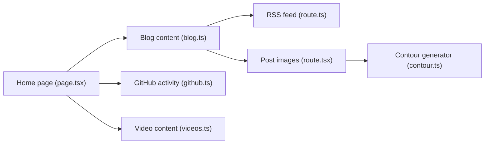

# woosal1337/blog

> Code d'un blog et portfolio personnel Next.js en thème sombre, publié sur Vercel.

## Le problème
Un site personnel demande un thème, un système de billets et des visuels de couverture sans produire des images à la main.

## Ce que ça fait vraiment
Site Next.js 14 (App Router) avec billets MDX, table des matières latérale, bannières générées depuis le titre par une marque en courbes de niveau (`lib/contour.ts`), thème sombre Tailwind, composants de design et blocs ASCII. Les sections incluent écriture, vidéos, projets, galerie et étagère de lecture ; la page d'accueil agrège billets, épisodes et activité GitHub. Flux RSS et images de billets générés par routes. Aucune variable d'environnement requise.

## Comment c'est branché


## Essayer
```bash
bun install
bun dev
bun run build
bun run check
```

## Coût et pièges
Gratuit ; Node 20+ et Bun requis. La licence n'est pas identifiée par GitHub, donc la réutilisation du code est incertaine.

## Ce que ce n'est pas
Pas un gabarit prêt à forker : c'est le site d'une personne, avec son contenu et son identité visuelle.

## Alternatives
Aucune alternative nommée dans le README (il cite soft-club-ui et LineNav comme sources de composants).

## Pour toi
À ignorer : un blog personnel sans portée générale ; seul le générateur de couvertures déterministes peut inspirer.

