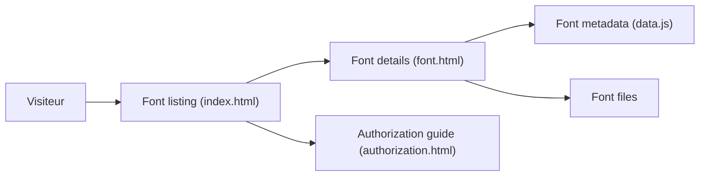

# wordshub/free-font

> Catalogue de polices chinoises libres ou gratuites pour usage commercial, avec leurs conditions de licence.

## Le problème
Les licences de polices chinoises sont variées et obscures ; les petites structures ne savent pas lesquelles sont réellement utilisables sans frais.

## Ce que ça fait vraiment
Recense des dizaines de polices (Fangzheng, Source Han, ZCOOL, Wenquanyi, Wang Han-Zong, OPPO Sans, Alibaba PuHuiTi, polices japonaises…), classées par style, avec description et origine de l'autorisation. Une section explique la différence entre « gratuit commercial » et « libre » (GPL, SIL OFL, IPA) et signale les polices à risque (GPL des Wenquanyi, litige sur les polices Wang Han-Zong). Le site statique s'appuie sur `data.js`, `index.html` et `font.html`. Les sections « Anglais » et « Chiffres » sont vides.

## Comment c'est branché

## Essayer
Aucune commande documentée : on consulte le catalogue.

## Coût et pièges
Gratuit, mais le dépôt n'a pas de licence déclarée et le dernier push date de février 2025 ; les conditions des éditeurs peuvent avoir changé (le README le signale lui-même).

## Ce que ce n'est pas
Pas un avis juridique : l'avertissement final le dit. Pas non plus un hébergeur garanti des fichiers de police.

## Alternatives
Aucune alternative nommée dans le README (il cite des guides externes).

## Pour toi
À ignorer : utile seulement pour un projet de design en chinois ; sans rapport avec ton métier.

