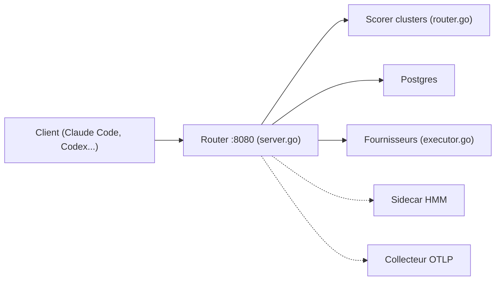

# workweave/router

> Proxy compatible Anthropic, OpenAI et Gemini qui choisit un modèle par requête, pour utilisateurs d'agents de code.

## Le problème
Choisir à la main le modèle pour chaque tâche coûte cher ou dégrade la qualité ; chaque client parle un format d'API différent.

## Ce que ça fait vraiment
Un routeur écoute sur `localhost:8080` et expose Messages Anthropic, Chat Completions OpenAI et Gemini. Un scorer par clusters (inspiré d'Avengers-Pro, embedder ONNX embarqué) choisit le modèle parmi les fournisseurs activés, par action. Un sidecar HMM est optionnel. Postgres stocke clés `rk_`, clés BYOK chiffrées et usage ; traces OTLP ; tableau de bord en auto-hébergement. Un installeur npm configure Claude Code, Codex, opencode ou pi.

## Comment c'est branché


## Essayer
```bash
npx @weave-os/router
echo "OPENROUTER_API_KEY=sk-or-v1-..." >> .env.local
echo "ROUTER_ADMIN_PASSWORD=..." >> .env.local
make full-setup
```

## Coût et pièges
Tu paies les fournisseurs en amont ; le mode « hébergé » passe par Weave. Auto-hébergement : Postgres et Docker. Multi-réplicas : Pub/Sub nécessaire. Le sidecar HMM demande une clé Google.

## Ce que ce n'est pas
Pas un modèle : une couche de routage. Le support Cursor est annoncé en bêta. Les économies annoncées ne sont pas vérifiables depuis le README seul.

## Alternatives
OpenRouter (cité comme base pour les modèles open source) ; non documenté pour d'autres.

## Pour toi
À surveiller si tu consommes beaucoup d'API LLM via des agents de code : le routage par coût est concret, mais valide la qualité sur tes tâches avant de lui déléguer.

