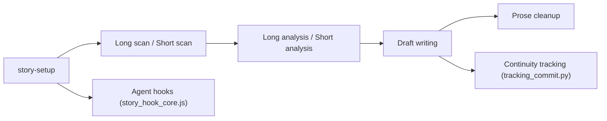

# worldwonderer/oh-story-claudecode

> Pack de 13 skills pour écrire des romans web avec un agent de code, destiné aux auteurs chinois.

## Le problème
Un long roman écrit avec un agent perd vite le fil : fils narratifs oubliés, personnages qui savent trop, ton qui sonne « IA ».

## Ce que ça fait vraiment
Installe 13 skills couvrant scan de classements, analyse de textes, écriture longue et courte, import de manuscrits, relecture, « dé-IA » et couverture. La mémoire passe par des fichiers : un `_tracking-state.json` unique génère les vues de suivi (contexte, intrigues, personnages). Des hooks bloquent l'écriture d'un chapitre sans plan détaillé ; des scripts lint repèrent les tournures typiques d'IA et vérifient le nombre de mots. Aucun GPU requis : le modèle est celui de l'agent hôte. Documentation en chinois.

## Comment c'est branché


## Essayer
```bash
npx skills add zenstory-ai/oh-story-claudecode -y -g
```
Puis `/story-setup` à la racine du projet d'écriture et ouvrir une nouvelle session.

## Coût et pièges
Les tokens de l'agent hôte sont à ta charge ; la couverture (`story-cover`) appelle GPT-Image-2. Il faut relancer `/story-setup` après chaque mise à jour.

## Ce que ce n'est pas
Pas un générateur de romans autonome ni un moyen de contourner les détecteurs d'IA : le README dit viser la lisibilité.

## Alternatives
Aucune alternative nommée dans le README.

## Pour toi
À surveiller : la gestion de mémoire par fichiers et les portes de contrôle sont un bon modèle d'orchestration d'agents, même si le domaine (romans web chinois) est éloigné du tien.

