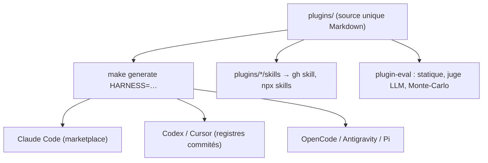

# wshobson/agents

> Place de marché de 94 plugins d'agents, skills et commandes pour six environnements.

## Le problème
Les agents et skills utiles se réécrivent à chaque environnement, et charger un catalogue entier
noie le contexte sous des définitions dont on n'utilise qu'une poignée.

## Ce que ça fait vraiment
Tient une source unique dans `plugins/` et en génère des artefacts idiomatiques pour Claude Code,
Codex CLI, Cursor, OpenCode, Antigravity, Copilot et Pi.
Compte 94 plugins, 202 agents spécialisés, 183 skills à divulgation progressive, 105 commandes et
16 orchestrateurs multi-agents. Chaque plugin est isolé : l'installer ne charge que ses composants.
Affecte un modèle par niveau — Fable 5 pour les travaux autonomes longs, Opus pour l'architecture
et la sécurité, Sonnet pour docs et tests, Haiku pour l'opérationnel rapide.
Fournit `plugin-eval`, un cadre d'évaluation à trois couches : analyse structurelle statique,
juge LLM sur quatre dimensions, et fiabilité statistique par Monte-Carlo sur 50 à 100 exécutions.

## Comment c'est branché


## Essayer
```bash
/plugin marketplace add wshobson/agents
/plugin install python-development
npx codex-marketplace add wshobson/agents
gh skill install wshobson/agents python-testing-patterns --agent claude-code
uv run plugin-eval score path/to/skill --depth quick
```

## Coût et pièges
Gratuit. Les exécutions de `plugin-eval` consomment des tokens : le juge LLM tourne sur Haiku et
Sonnet, et la couche Monte-Carlo demande 2 à 5 minutes de simulations. Deux entrées externes sont
tirées d'autres dépôts par `git-subdir` (Pensyve, HOL Guard) ; HOL Guard est épinglé sur un commit
précis et son installation demande une approbation explicite, car son CLI peut modifier
la configuration des hooks.

## Ce que ce n'est pas
Ce n'est pas un catalogue relu par un tiers : c'est le travail d'un mainteneur, à volume élevé.
Ce n'est pas un ensemble à installer en bloc — l'isolation par plugin existe justement pour ça.
Les compteurs impressionnent, ils ne disent rien de la qualité de chaque définition.

## Alternatives
- **anthropics/claude-plugins-official** : annuaire officiel, plus restreint et filtré.
- **github/awesome-copilot** : équivalent côté Copilot.

## Pour toi
À fouiller pour deux ou trois skills précis ; `plugin-eval` est l'idée réutilisable du dépôt.
